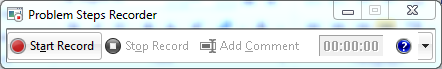

# How to Get Help

### Need Help? Contact Support

If you face any issues, you can:

- Email us at **support@nopaccelerate.com**
- Or use the support form:  
  <http://www.nopaccelerate.com/wiki/support>

---

## Common Issues

### Ask AI shows "An unexpected error occurred"

- Check that **Allow External Data Transmission** is enabled in Settings.
- Verify your API key is correct using the **Test Connection** button.
- Ensure your selected **Provider** matches the API key format (e.g. OpenRouter keys start with `sk-or-v1-`).

### Dashboard charts are empty

- Make sure at least one non-cancelled order exists within the selected date range.
- Click **Refresh** after changing the date range.

### Locale resource keys appear instead of labels (e.g. `Plugins.Widgets.AIAnalytics.Settings.IsEnabled`)

- This means the locale strings were not installed. Go to **Admin → Local Plugins**, click **Uninstall** on the plugin, then **Install** again to re-run the installation routine.

---

You can also send us the exact steps to reproduce an issue by recording it using the **Problem Steps Recorder (psr.exe)** on Windows:

1. Open **Run** in Windows and type `psr.exe`, then press **Enter**.
2. Click **Start Record** and perform the steps that produce the issue.
3. When done, click **Stop Record**.
4. You will be prompted to save a **.zip** file.
5. Email the saved **.zip** file to us along with a short description of the issue.

{ .img-border }

[← Previous](scenarios-of-use.md)
