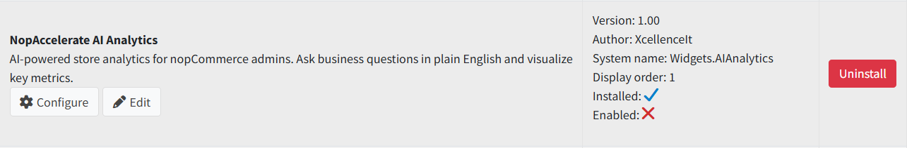

# Installation Guide

👉 Download the **NopAccelerate AI Analytics Plugin** from our store:  
[https://shop.nopaccelerate.com](https://shop.nopaccelerate.com)

**Step 1** : Go to **Administration → Configuration → Local Plugins**.

**Step 2** : Upload the **NopAccelerate.Plugin.Widgets.AIAnalytics** zip file using the **"Upload plugin or theme"** button.

**Step 3** : Restart the application.

**Step 4** : Locate **NopAccelerate AI Analytics** in the plugin list.

**Step 5** : Click **Install** to complete the setup. The plugin will automatically create the required database table for chat history.

**Step 6** : After installation, click **"Restart application to apply changes"** at the top of the page.

**Step 7** : Click **Configure** to open the Settings page and enter your AI provider API key.

{ .img-border }

> You may need to grant read/write permissions to the IIS user on the server where your website is deployed in order to install this plugin.

> **Note:** The plugin installs locale strings automatically during installation. If labels appear as resource keys (e.g. `Plugins.Widgets.AIAnalytics.Settings.IsEnabled`), uninstall and reinstall the plugin to re-run the installation routine.

[← Previous](1.00.md) | [Next →](licence.md)
