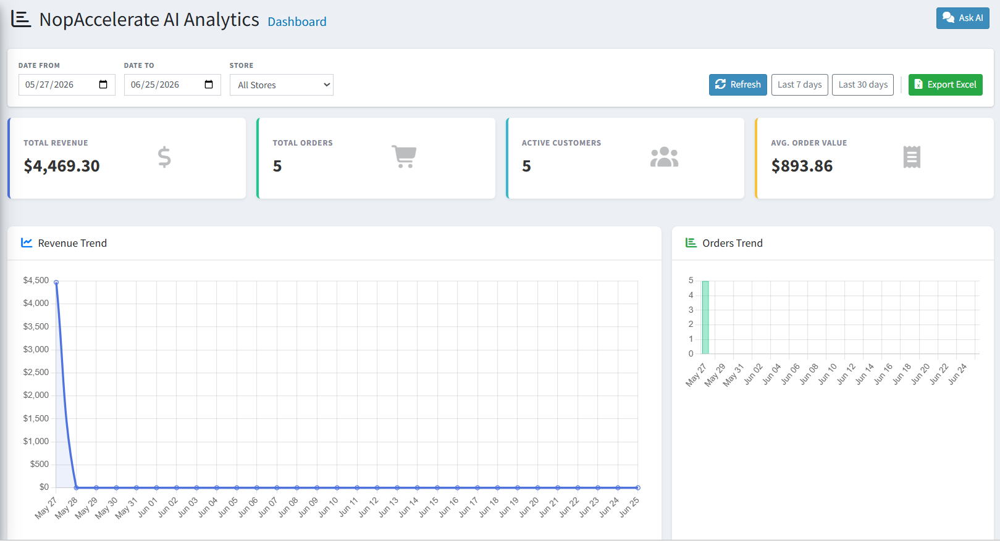
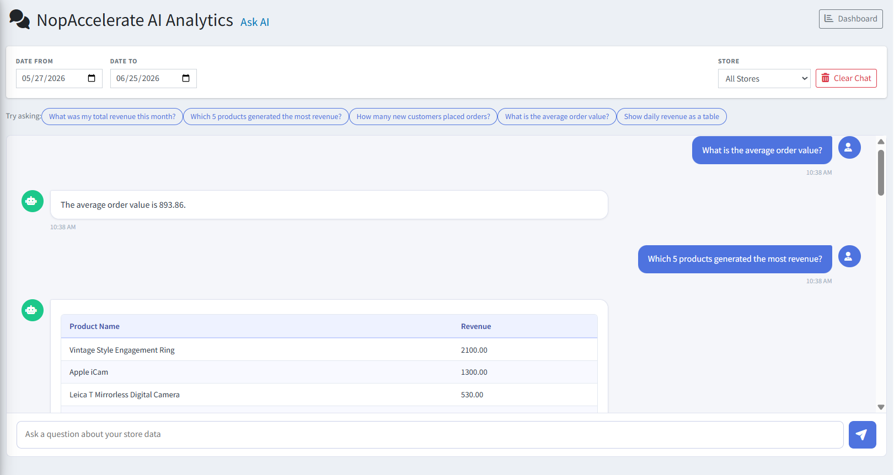

# Scenarios of Use

The following examples show how **NopAccelerate AI Analytics** helps store admins make better decisions faster.

---

## Revenue Analysis

A store manager wants to know how revenue performed over the last 30 days. They open the Dashboard, click **Last 30 days**, and instantly see the Total Revenue KPI card and the Revenue Trend chart showing day-by-day performance across the full period.

{ .img-border }

---

## Conversational Data Queries

Instead of building a custom report, an admin opens Ask AI and types:

> *"Which 5 products generated the most revenue?"*

The AI responds with a formatted table showing product names and revenue values — no SQL, no manual export needed.

{ .img-border }

---

## Comparing Store Performance

In a multi-store setup, the admin uses the **Store** filter to switch between stores and compare Total Orders and Revenue side-by-side across different date ranges using the Dashboard.

---

## Exporting for Reporting

A store owner needs to share monthly performance data with their accountant. They set the date range to the previous month and click **Export Excel**. The downloaded file contains a Summary sheet with KPIs, a Daily Revenue sheet, and a Top Products sheet — ready to share.

---

> If Ask AI is not responding, check that **Allow External Data Transmission** is enabled in [Settings](settings.md) and that your API key is valid using the **Test Connection** button.

[← Previous](ask-ai.md) | [Next →](help.md)
