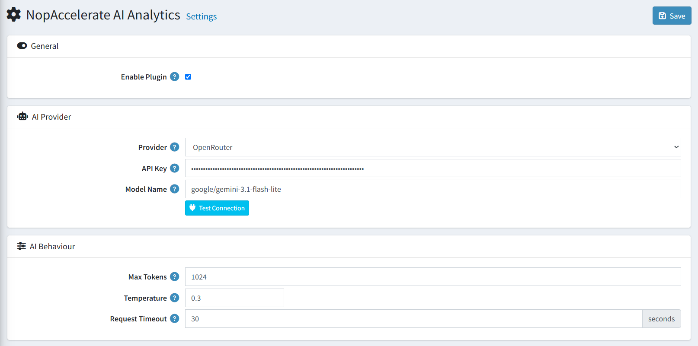
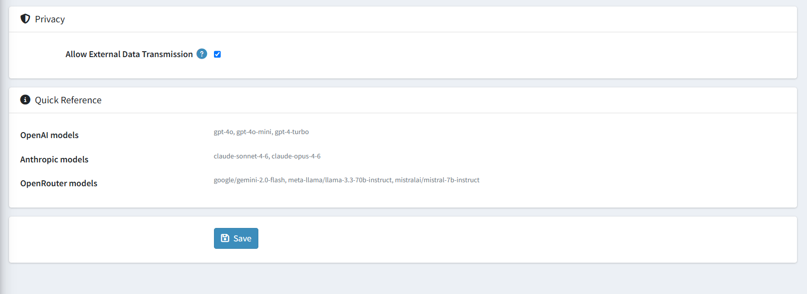

# Settings

The Settings page is accessible from **NopBot AI Analytics → Settings** in the admin sidebar. All plugin configuration is managed here.

{ .img-border }

---

## General

| **Setting**       | **Description**                                                                  |
|-------------------|----------------------------------------------------------------------------------|
| **Enable Plugin** | Enables or disables the entire NopAccelerate AI Analytics plugin. Uncheck to hide the plugin from the admin sidebar without uninstalling it. |

---

## AI Provider

| **Setting**       | **Description**                                                                                              |
|-------------------|--------------------------------------------------------------------------------------------------------------|
| **Provider**      | Select your AI service provider. Options: OpenAI, Anthropic (Claude), OpenRouter (Multi-model), Azure OpenAI, Custom / Self-hosted. |
| **API Key**       | Your secret API key from the selected provider. Leave blank to keep the existing saved key.                  |
| **Model Name**    | The model identifier to use. Examples: `gpt-4o`, `claude-sonnet-4-6`, `google/gemini-2.0-flash`.            |
| **Endpoint URL**  | Required only for **Azure OpenAI** or **Custom / Self-hosted** models. Leave blank for all other providers — endpoints are resolved automatically. |

### Provider Quick Reference

| **Provider**    | **Example Models**                                                                 | **Notes**                              |
|-----------------|------------------------------------------------------------------------------------|----------------------------------------|
| OpenAI          | `gpt-4o`, `gpt-4o-mini`, `gpt-4-turbo`                                            | Standard OpenAI API key                |
| Anthropic       | `claude-sonnet-4-6`, `claude-opus-4-6`                                             | Anthropic API key                      |
| OpenRouter      | `google/gemini-2.0-flash`, `meta-llama/llama-3.3-70b-instruct`, `mistralai/mistral-7b-instruct` | API key starts with `sk-or-v1-`        |
| Azure OpenAI    | Your deployment name                                                               | Requires Endpoint URL                  |
| Custom          | Any OpenAI-compatible model                                                        | Requires Endpoint URL                  |

### How to Get Your API Key (OpenRouter)

1. Go to [https://openrouter.ai](https://openrouter.ai) and create a free account.
2. Navigate to **API Keys** in your account settings.
3. Generate a new key — it will start with `sk-or-v1-`.
4. Paste it into the **API Key** field and set **Provider** to **OpenRouter (Multi-model)**.

---

## AI Behaviour

| **Setting**           | **Description**                                                                             |
|-----------------------|---------------------------------------------------------------------------------------------|
| **Max Tokens**        | Maximum number of tokens the AI may return per response. Range: 100–8192. Default: 1024.   |
| **Temperature**       | Controls response creativity. `0` = fully deterministic, `1` = highly creative. Recommended: `0.1–0.2` for analytics answers. |
| **Request Timeout**   | HTTP timeout for AI provider calls in seconds. Range: 5–120. Default: 30 seconds.          |

---

## Privacy

{ .img-border }

| **Setting**                          | **Description**                                                                                                                   |
|--------------------------------------|-----------------------------------------------------------------------------------------------------------------------------------|
| **Allow External Data Transmission** | When enabled, aggregated store metrics (revenue totals, order counts, product names) are sent to the configured AI provider. **Raw customer PII is never transmitted.** The Ask AI feature requires this to be enabled. |

> **Important:** If this setting is disabled, the Ask AI chat will return an error message and refuse to process questions. Enable it to allow the plugin to send anonymized store metrics to the AI for analysis.

---

## Test Connection

After entering your API key and model name, click the **Test Connection** button to verify your credentials before saving. The button will display either a success message or a descriptive error so you can diagnose problems immediately.

---

## Saving Settings

Click the **Save** button in the top-right corner or at the bottom of the page. A success notification will confirm the settings were saved.

[← Previous](licence.md) | [Next →](dashboard.md)
