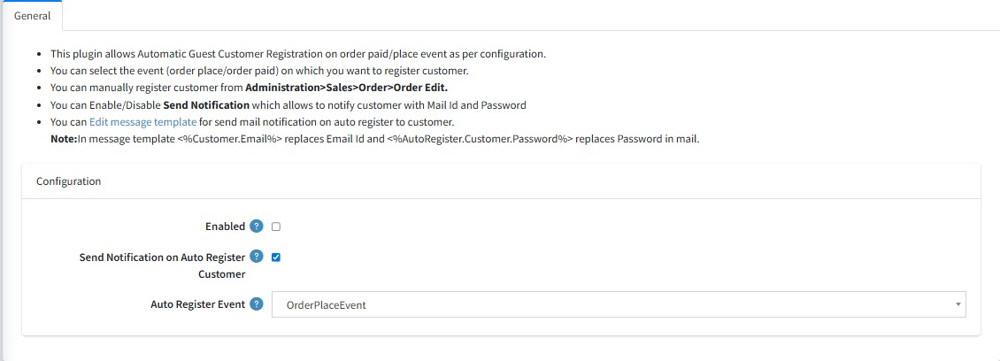

You need to configure plug-in in general tab as shown in the below figure.

**Enabled:** To make plug-in work, you need to enable plug-in by checking check-box for “Enable”.

**Send Notification:** Enable/Disable Send Notification which allows to send mail to the customer with Mail Id and Password.  
&nbsp;&nbsp;&nbsp;&nbsp;*[Note: If you set send notification true then you need to configure email account.]*

**Auto Register Event:** Select auto register event(order placed Event or order paid event) on which you want to register the customer.  
&nbsp;&nbsp;&nbsp;&nbsp;*[Note: By default order place event is selected]*

Admin can Edit Message Template from the given link for sending mail to customer as shown in below figure.

[← Previous](Licence.md) | [Next →](EmailConfiguration.md)