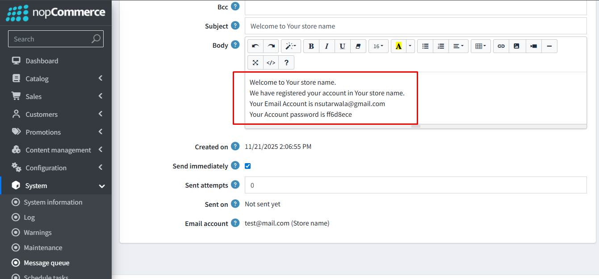

- When customer will be automatically registered on order place/paid event or manually registered from admin side then customer will get email notification with email id and auto generated password. Also message template for auto register notification is editable from here.

[← Previous](OrderEditPage.md) | [Next →](EditMessageTemplate.md)
