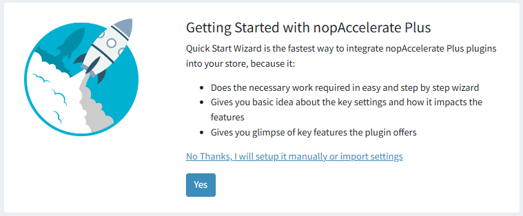
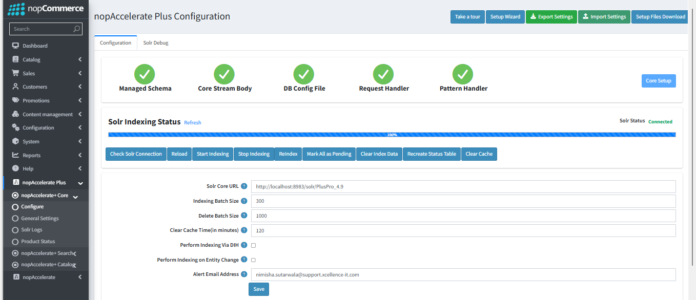

Once your license is verified, you will be taken to the Getting Started screen. You will have two choices:

### 1. Quick Wizard Service
**What it does:** Automatically helps you set up Solr and Java on your server step-by-step. It is the easiest way to get everything running perfectly.  
**Action:** Click "Yes" to start the wizard.

### 2. Manual Setup
**What it does:** Lets you install and configure Solr and Java yourself manually.  
**Action:** Click "No thanks" to skip the wizard.  
**Note:** You can read our guides on [Java Setup](JAVASetup.md) and [Solr Setup](SOLRSetup.md) for help.

---

After setting up Java and Solr, you need to start indexing. The supported Solr versions are 8.11.0 to 8.11.4, and the supported Java version is Java 1.8.0_451.

---

## Admin Configuration

- **Configure:** You can take a tour to see detailed information about all the features on the page.

- **Perform Indexing Via DIH:** This option is applicable only when using Microsoft SQL Server (MSSQL). If your nopCommerce store is configured with MSSQL, it is recommended to enable this setting for better indexing performance.
If you are using PostgreSQL or MySQL, this option should remain disabled, as DIH-based indexing is not supported for these database providers.

- **General Settings:** The General settings allow you to configure Solr-based product search, pricing, attributes, and indexing behavior. These options help optimize performance, control caching, and manage how product data is fetched and displayed.

- **Solr Logs:** The Solr Logs page helps you monitor the activity of your search engine. It records a history of important background tasks—such as product indexing and data synchronization—so you can easily verify that your store is working correctly.

- **Product Status:** The Product Status page is your central dashboard for verifying which products are successfully indexed in Solr and for manually fixing any sync issues. It allows you to check the "Solr Status" of any product in your catalog.

[← Previous](Licensing&Activation.md) | [Next →](Searchconfiguration.md)