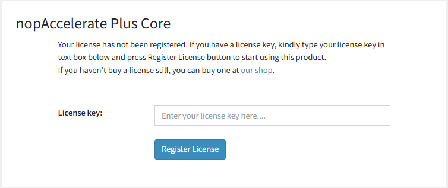

- After installation, open the plugin configuration page.  
- You will be prompted to enter your **License Key**.  
- Enter the license key received on your **registered email** after purchase.  
- Save the **Register license** to activate the plugin.

[← Previous](nopAcceleratePlusProInstallation.md) | [Next →](CoreConfiguration.md)