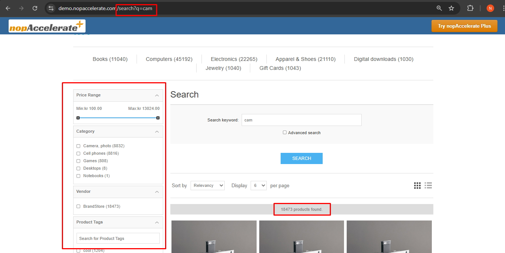
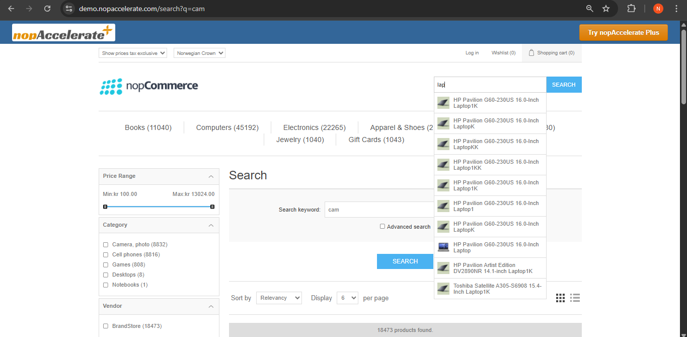
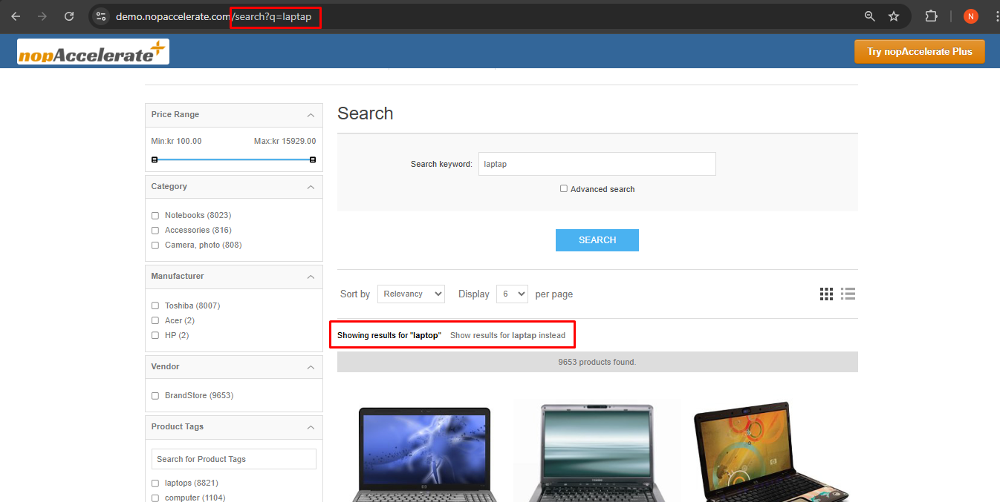
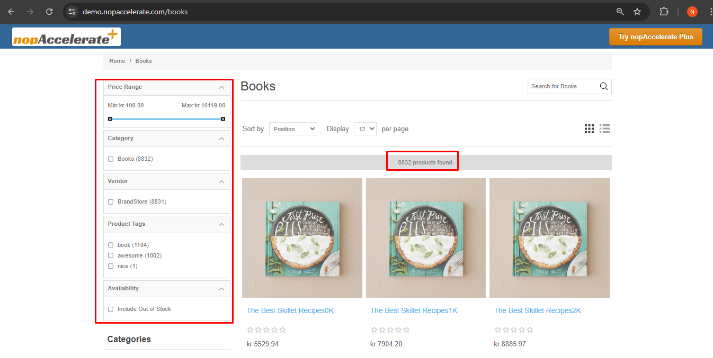

### 1. Enhanced Search Results Page

Filters, Speed, and Control. Transform your basic search results into a powerful shopping hub.

- **Sidebar Filters:** Customers can narrow down search results by Price, Brand, or Category.  
- **Total Count:** Clearly displays the total number of matching products.

### 2. Instant Auto-Complete

Predicts what they want in milliseconds. As soon as a customer starts typing "Cam...", the search bar instantly drops down with highly relevant product suggestions. This helps users discover products faster without even waiting for a results page to load.

### 3. Smart Spell Check ("Did You Mean?")

Never lose a sale to a typo. Even if a customer types incorrectly (e.g., "laptap" instead of "laptop"), Solr understands their intent. It automatically suggests the correct term ("Showing results for laptop") so users find products instantly instead of seeing an empty page.

---

## Improved Catalog Pages with Advanced Filters

This is how your category pages (like "Books") look after enabling nopAccelerate Plus. You get an instant upgrade with these powerful new features:

- **Smart Sidebar Filters (Facets):** Notice the new sidebar? Customers can now filter by Price Range (using a slider), Category, Vendor, Tags, and Stock Availability instantly.  
- **Product Count:** A clear "X products found" bar confirms exactly how many items match the current filters.  
- **Search Within Category:** (Top Right) A dedicated search box allows customers to search specifically inside the "Books" category to find exactly what they need.

[← Previous](catalogconfiguration.md) | [Next →](JAVASetup.md)