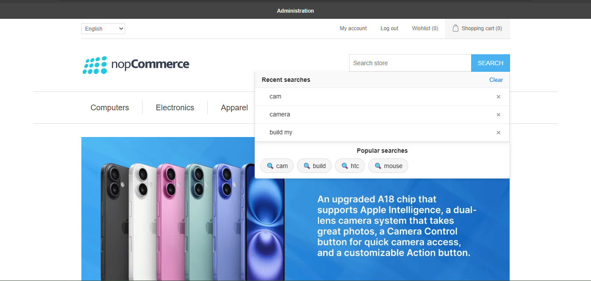

### 1. Enhanced Search Results Page

Filters, Speed, and Control. Transform your basic search results into a powerful shopping hub.

- **Sidebar Filters:** Customers can narrow down search results by Price, Brand, or Category.  
- **Total Count:** Clearly displays the total number of matching products.

### 2. Instant Auto-Complete

Predicts what they want in milliseconds. As soon as a customer starts typing "Cam...", the search bar instantly drops down with highly relevant product suggestions. This helps users discover products faster without even waiting for a results page to load.

### 3. Smart Spell Check ("Did You Mean?")

Never lose a sale to a typo. Even if a customer types incorrectly (e.g., "laptap" instead of "laptop"), Solr understands their intent. It automatically suggests the correct term ("Showing results for laptop") so users find products instantly instead of seeing an empty page.

---

## Improved Catalog Pages with Advanced Filters

This is how your category pages (like "Books") look after enabling nopAccelerate Plus. You get an instant upgrade with these powerful new features:

- **Smart Sidebar Filters (Facets):** Notice the new sidebar? Customers can now filter by Price Range (using a slider), Category, Vendor, Tags, and Stock Availability instantly.  
- **Product Count:** A clear "X products found" bar confirms exactly how many items match the current filters.  
- **Search Within Category:** (Top Right) A dedicated search box allows customers to search specifically inside the "Books" category to find exactly what they need.

## Enhanced Search Experience with Smart Suggestions

This is how your search bar looks after enabling nopAccelerate Plus Pro. It transforms a basic search box into an intelligent discovery tool that guides users instantly.

- **Recent Searches:** As users click on the search bar, they can see their previously searched terms. This allows them to quickly revisit past searches without typing again, improving convenience and speed.

- **Popular Searches:** Displays trending and frequently searched keywords, helping users discover what others are looking for and guiding them toward relevant products.

- **Quick Remove Option:** Users can easily remove individual recent searches or clear all history with a single click for better control.

- **Pre-filtered Search (Keyword Mapping):** When users search for specific terms, they can be redirected to predefined pages such as categories, filtered results, or promotional landing pages—ensuring they land exactly where you want them.

- **Faster Product Discovery:** By combining recent activity and trending searches, users find products quicker without needing to type full queries.

[← Previous](catalogconfiguration.md) | [Next →](JAVASetup.md)