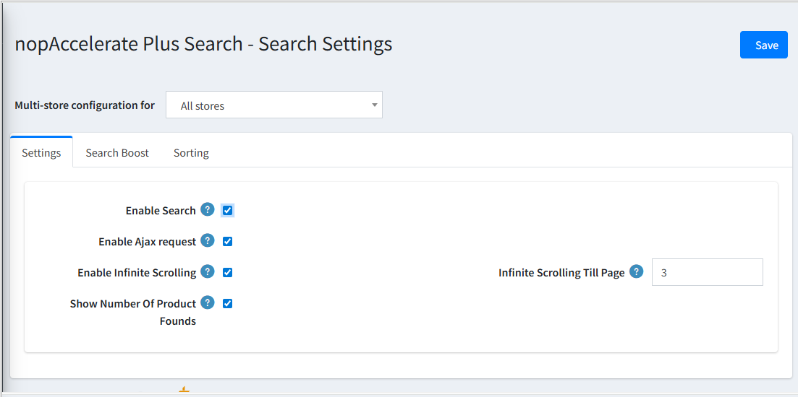
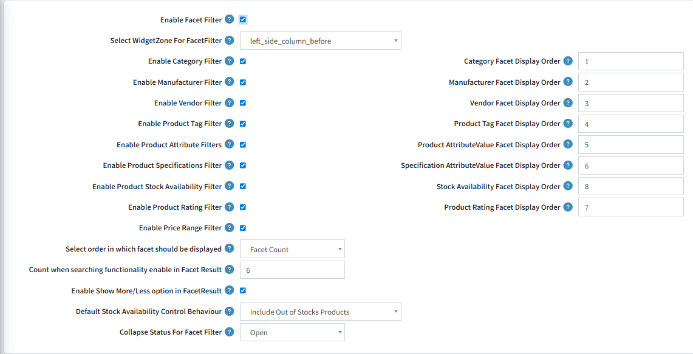

## Search Settings

This section is the "command center" for your store's search bar. By configuring these tabs, you switch your search engine from the default database to the high-speed Solr engine.

### 1. Settings Tab

This is where you activate the plugin.

- **Enable Search:** Check this box to instantly switch your site's search engine to Solr. Once enabled, all search queries will be processed by Solr for lightning-fast results.  
- **Enable Ajax Request:** Turns on "live" searching, so results appear without reloading the page.  
- **Enable Infinite Scrolling:** Replaces "Next Page" buttons with modern social-media style scrolling.

### 2. Search Boost Tab

Control how the engine decides which products are important. You can assign a "score" (Boost value) to different product fields.

**Why use this?** If you want a search for "Nike" to show products with "Nike" in the Product Name BEFORE products with "Nike" in the Description, you would give the Name field a higher boost score (e.g., 10) than the Description field (e.g., 4).  

**Search Fields:** Select exactly which data (SKU, Manufacturer, Tags, etc.) the engine should look at when a customer types a query.

### 3. Sorting Tab

Manage the sort options available to your customers on the search results page.  

**Relevancy:** The default and most powerful sorting method. It shows the best matches first based on your "Search Boost" settings.

---

## Facet Settings

"Facets" are simply the smart filters that appear on the sidebar of your search results (like filtering by Price, Brand, or Color). This page lets you choose exactly which filters to show your customers.

- **Enable Filters:** Tick the boxes to turn on specific filters like Price Range, Manufacturer, Rating, or Stock Availability.  
- **Drag & Drop Ordering:** Use the "Display Order" numbers to decide which filter appears at the top of the sidebar.  
- **Smart Features:** Enable "Show More/Less" buttons to keep long lists of brands or tags tidy, and choose if filters should be open or collapsed by default.

[← Previous](CoreConfiguration.md) | [Next →](catalogconfiguration.md)