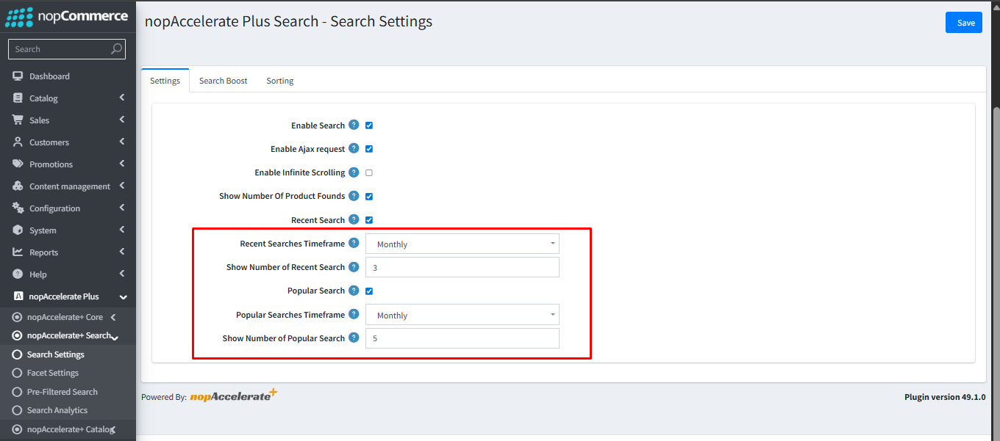
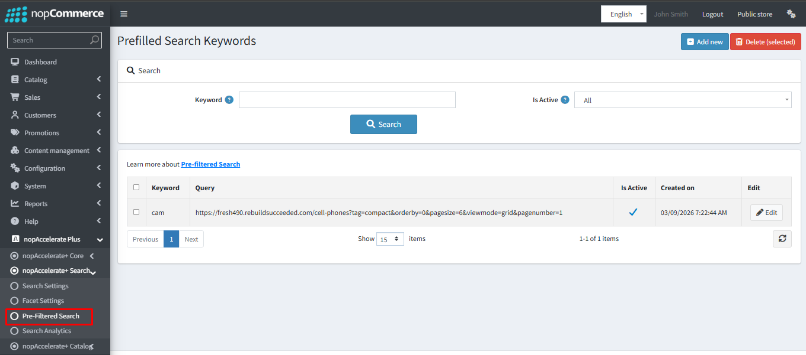
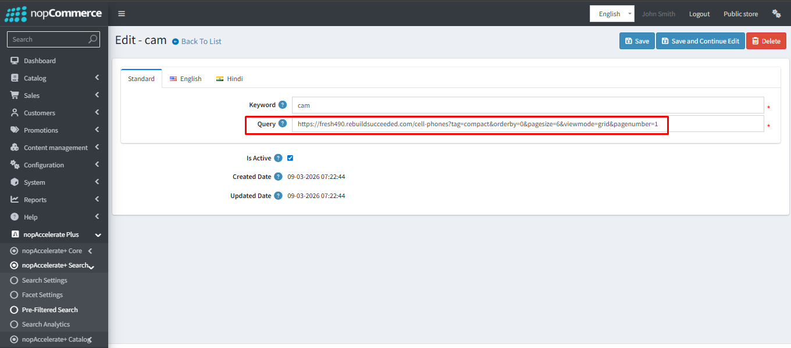
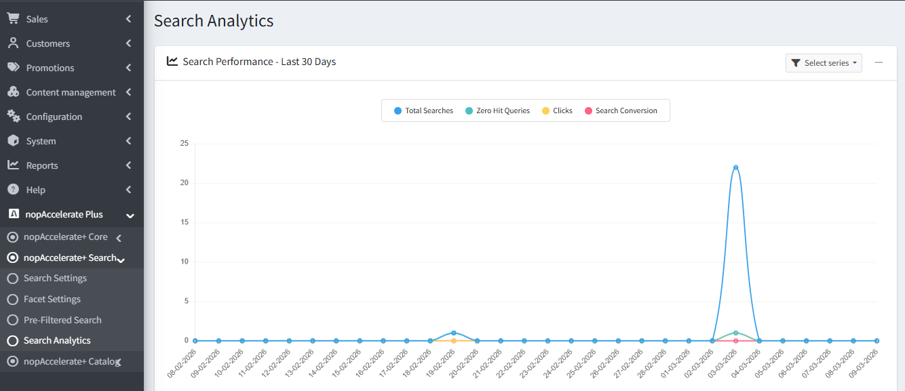
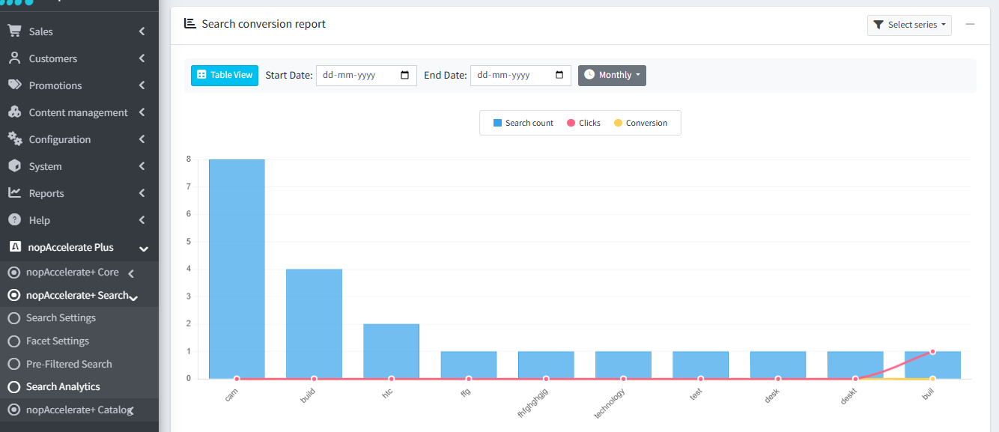
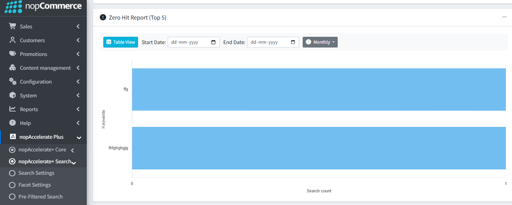
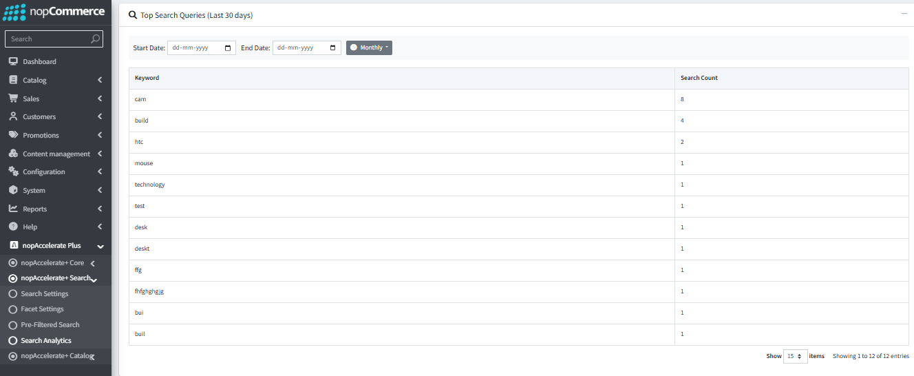

## 1. Search Settings

This section is the "command center" for your store's search bar. By configuring these tabs, you switch your search engine from the default database to the high-speed Solr engine.

### 1. Settings Tab

This is where you activate the plugin.

- **Enable Search:** Check this box to instantly switch your site's search engine to Solr. Once enabled, all search queries will be processed by Solr for lightning-fast results.  
- **Enable Ajax Request:** Turns on "live" searching, so results appear without reloading the page.  
- **Enable Infinite Scrolling:** Replaces "Next Page" buttons with modern social-media style scrolling.

### 2. Search Boost Tab

Control how the engine decides which products are important. You can assign a "score" (Boost value) to different product fields.

**Why use this?** If you want a search for "Nike" to show products with "Nike" in the Product Name BEFORE products with "Nike" in the Description, you would give the Name field a higher boost score (e.g., 10) than the Description field (e.g., 4).  

**Search Fields:** Select exactly which data (SKU, Manufacturer, Tags, etc.) the engine should look at when a customer types a query.

### 3. Sorting Tab

Manage the sort options available to your customers on the search results page.  

**Relevancy:** The default and most powerful sorting method. It shows the best matches first based on your "Search Boost" settings.

### 4. Admin Configuration: Recent & Popular Search Settings

This section allows you to customize the "Smart Suggestions" your customers see in the search bar.

### Recent Search Settings
- **Recent Search:** Check this box to enable the history feature. It keeps a private list of search terms for each customer, making it easy for them to return to previous interests.
- **Recent Searches Timeframe:** Choose how long the system should remember a user's search history (e.g., Monthly).
- **Show Number of Recent Search:** Control exactly how many past search terms are displayed to the user (e.g., top 3).

### Popular Search Settings
- **Popular Search:** Check this box to enable trending keywords. This shows aggregate trends from across your entire store to every visitor.
- **Popular Searches Timeframe:** Control the "freshness" of trends. Setting this to **Daily** ensures the most recent viral products are shown, while **Monthly** highlights long-term top performers.
- **Show Number of Popular Search:** Decide how many trending tags to display (e.g., top 5) to keep your UI clean and focused.
---

## 2.  Facet Settings

"Facets" are simply the smart filters that appear on the sidebar of your search results (like filtering by Price, Brand, or Color). This page lets you choose exactly which filters to show your customers.

- **Enable Filters:** Tick the boxes to turn on specific filters like Price Range, Manufacturer, Rating, or Stock Availability.  
- **Drag & Drop Ordering:** Use the "Display Order" numbers to decide which filter appears at the top of the sidebar.  
- **Smart Features:** Enable "Show More/Less" buttons to keep long lists of brands or tags tidy, and choose if filters should be open or collapsed by default.

## 3.  Admin Configuration: Pre-filtered Search

This feature allows you to create specific "shortcuts" for your users by mapping search terms to exact URLs.

### Managing Keywords
- **Add New:** Click this to create a new mapping. Use this to link seasonal terms (like "Summer Collection") directly to a category or filtered landing page.
- **Search & Filter:** Easily find existing mappings using the keyword search or status filters (**All / Active / Inactive**).

### Creating a Mapping
- **Keyword:** The exact word or phrase the customer will type (e.g., "cam").
- **Query (URL):** The destination URL where the user will be redirected. This can include specific filters, sorting, and view modes to ensure the user lands exactly where you want them.
- **Is Active:** A quick toggle to enable or disable the mapping without deleting it—perfect for temporary promotions.

## 4. Search Analytics

The **Search Analytics dashboard** provides valuable insights into how customers use search on your store. It helps you understand what users are searching for, how they interact with results, and how search contributes to conversions.

### 1. Search Performance – Last 30 Days

This section displays an overview of search activity over the past 30 days using a visual chart.

- **Total Searches:** Shows the number of searches performed by customers.  
- **Zero Hit Queries:** Displays searches that returned no results.  
- **Clicks:** Indicates how often customers clicked on products from search results.  
- **Search Conversions:** Shows how many searches resulted in completed purchases.

**Why use this?**  
This report helps you monitor overall search performance and quickly identify trends. A rise in **Zero Hit Queries** may indicate that customers are searching for products that are not available or that product keywords need improvement.

---

### 2. Search Conversion Report

This report shows how customer searches translate into engagement and sales.

- **Chart View:** Displays search data visually, making it easier to identify trends and performance patterns.  
- **Table View:** Provides a detailed breakdown of search performance for each keyword.

**Table View includes:**

- **Total Searches:** Number of times a keyword was searched.  
- **Clicks:** Number of times customers clicked on a product from search results.  
- **Click Rate (%):** Percentage of searches that resulted in a click.  
- **Conversions:** Number of purchases generated from the search results.  
- **Conversion Rate (%):** Percentage of searches that resulted in a purchase.

**Why use this?**  
This report helps you identify high-performing keywords and understand which searches lead to customer engagement and purchases.

---

### 3. Zero Hit Report (Top 5)

This report highlights the most frequent search terms that returned no results.

- Displays the **top five keywords** where customers could not find any matching products.
- **Chart View**: Provides a visual representation of zero-hit trends over a selected time period (Daily, Weekly, or Monthly).

- **Table View**: Displays a structured list of the most frequent unsuccessful searches.

**Table View includes:**

- **Keyword**: The specific term entered by the customer that yielded no results.

- **Search Count**: The total number of times that specific keyword was searched.

**Why use this?**  
Zero hit searches reveal **missing product opportunities** or keywords that may need better tagging or synonyms. Addressing these queries can help improve search results and increase potential sales.

---

### 4. Top Search Queries

This section lists the most commonly searched keywords in your store.

- **Keyword:** The term entered by customers in the search bar.  
- **Search Count:** The number of times the keyword was searched.

**Why use this?**  
This report helps you understand what customers are actively looking for. You can use this data to optimize product listings, improve SEO, and align your inventory with customer demand.

[← Previous](CoreConfiguration.md) | [Next →](catalogconfiguration.md)