- Create a zip containing coreconfig folder
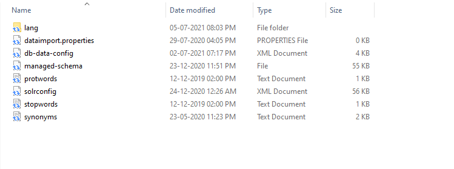

- Host zip file on secure location for solr create script to use it for core configuration on startup.
These should be accessible publicly.

- Host sqljdbc822.jar file on same location. These should be accessible publicly.

- Update db-data-config.xml file with your sql server credentials.

- They are now accessible at:

    http:// link-to-your-own-configset/configsets.zip -o  
    /opt/solr/server/solr/configsets/configsets.zip && 
      wget -nc http:// link-to-your-own-configset/sqljdbc822.jar -O /opt/solr/server/solr/configsets/sqljdbc822.jar

Create New Container App Service for Linux Container

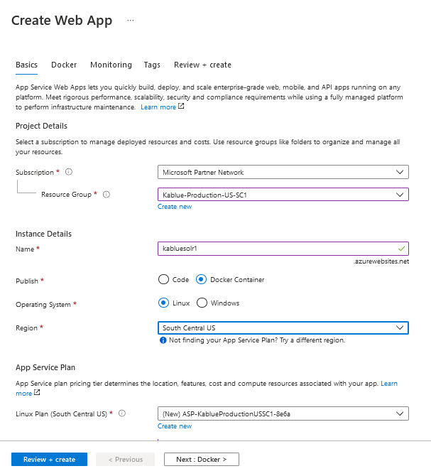

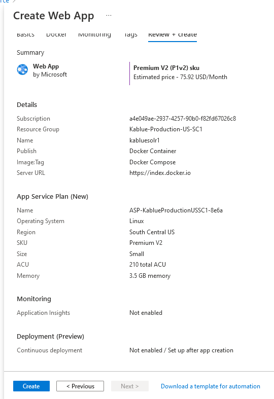

- Enable App Service Storage

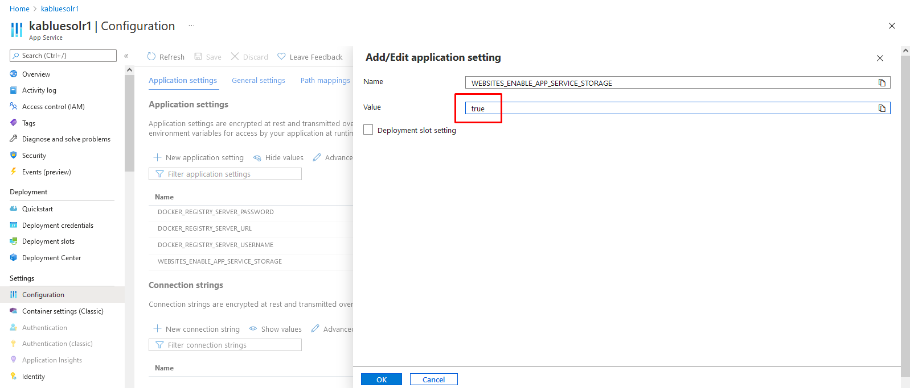

- Added two File Share in storage

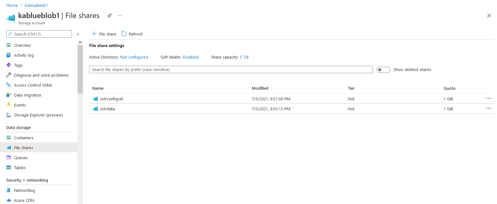

- Mount Storage in Container

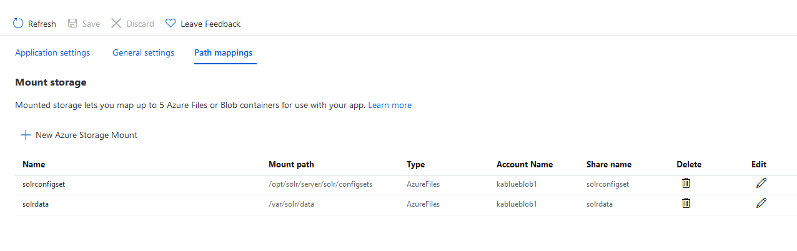

- Update docker-compose settings with mount storage

```yaml
version: '3'
services:
  solr:
    image: solr:8.1.1
    volumes:
      - solrconfigset:/opt/solr/server/solr/configsets
      - solrdata:/var/solr/data
    command:
      - bash
      - '-c'
      - >
        curl http://link-to-your-own-configset/configsets.zip -o /opt/solr/server/solr/configsets/configsets.zip &&
        wget -nc http://link-to-your-own-configset/sqljdbc822.jar -O /opt/solr/server/solr/configsets/sqljdbc822.jar || true &&
        unzip -o /opt/solr/server/solr/configsets/configsets.zip -d /opt/solr/server/solr/configsets &&
        precreate-core mycore2 /opt/solr/server/solr/configsets/nopaccelerate_core_config &&
        solr-foreground
```

- Restart container, it should restart without error. If there is error enable logs as described here: [https://docs.microsoft.com/en-us/azure/app-service/troubleshoot-diagnostic-logs](https://docs.microsoft.com/en-us/azure/app-service/troubleshoot-diagnostic-logs)

- Solr is UP

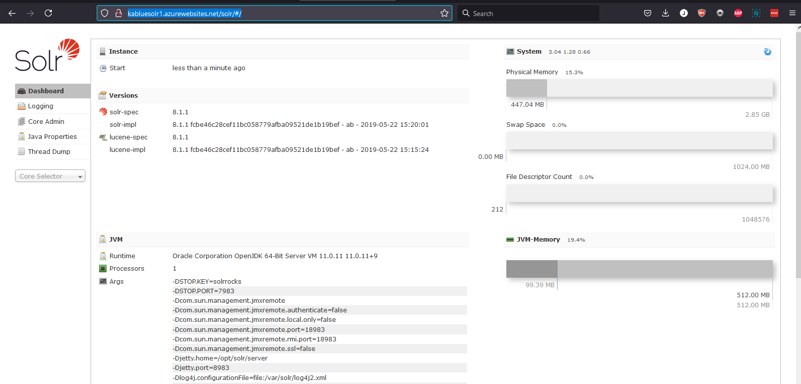

- A solr core is readily created with name ‘mycore2’. (it is defined in docker config file / docker-compose.yml). It’s ready to use.

- Or you can also create a core using:[http://SolrServiceURL/solr/admin/cores?action=CREATE&configSet=nopaccelerate_core_config&name=NEWCORENAME](http://SolrServiceURL/solr/admin/cores?action=CREATE&configSet=nopaccelerate_core_config&name=NEWCORENAME)

- Solr data and config is stored in storage account used:

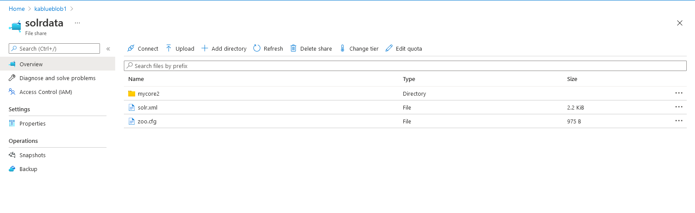

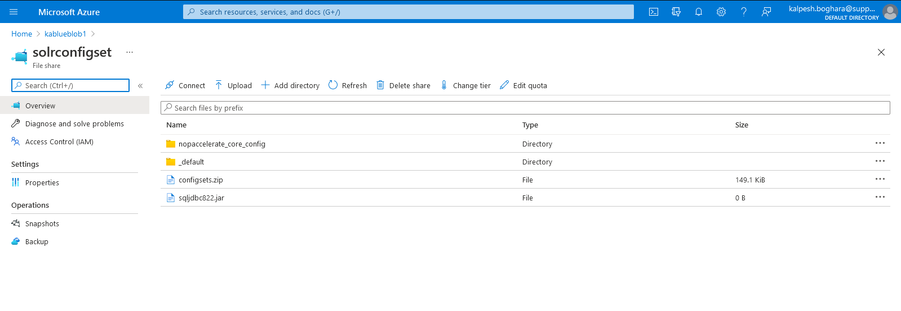

    - This ensure that data is stored and persisted when container is restarted or recreated / across containers when scaled.

- You can check error log here:

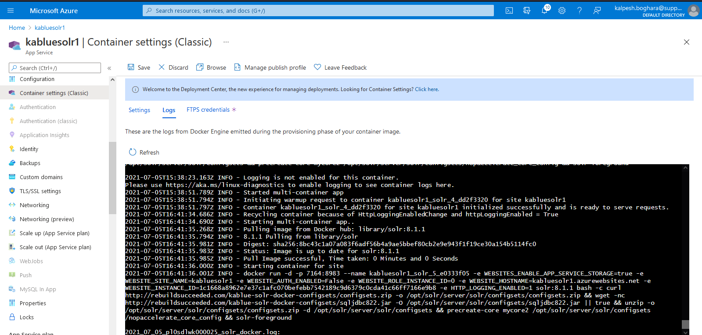

- Once Solr is up and Solr core is created, we need to update the docker config file (docker-compose.yml) to remove startup script to prevent it to download/extract coreconfig and create core. Because of this script, the existing core configs were being over-written in Azure storage causing the Solr to be unstable and eventually stop with java servlet error. 

    - To prevent this, we just need to update the config file like this.

```yaml
version: '3'
services:
  solr:
    image: solr:8.1.1
    volumes:
      - solrconfigset:/opt/solr/server/solr/configsets
      - solrdata:/var/solr/data
```

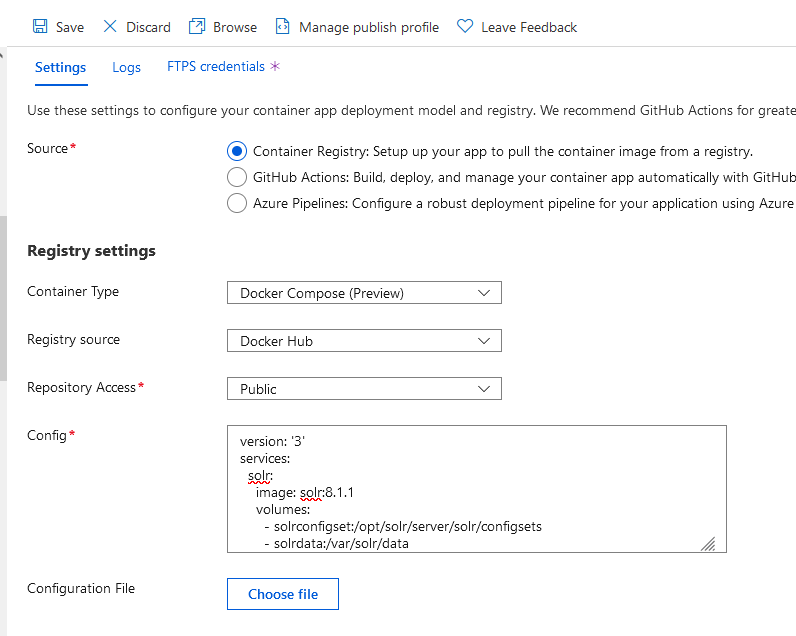

- Here are the reference links utilized: [https://www.getfishtank.com/insights/sitecore-solr-docker-app-service-on-azure](https://www.getfishtank.com/insights/sitecore-solr-docker-app-service-on-azure)

- We should add a basic IP based authentication to make sure that Solr is accessed securely only by the authorized client. These rules can be added by adding IP Based restrictions rules in Azure portal.

[← Previous](StartSolronSystemStartup.md) | [Next →](SetupCoreOnSharedServer.md)