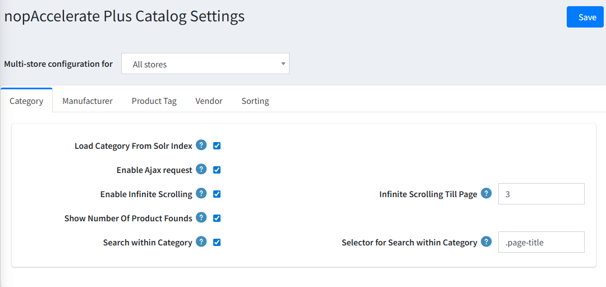
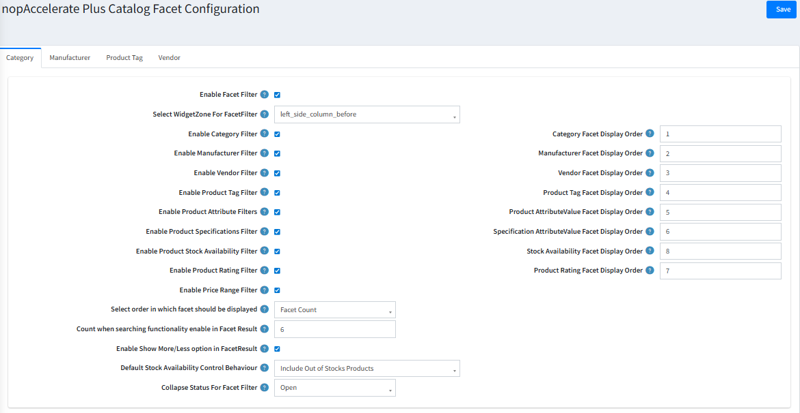

## Catalog Settings

This section allows you to upgrade your standard store pages (Categories, Manufacturers, Vendors, and Tags) to run on the high-speed Solr engine instead of the database for faster performance.

### 1. Category, Manufacturer, Vendor & Tag Tabs

Enable these settings to give your browsing pages the same speed and features as your search bar.

- **Load from Solr Index:** Turn this on to make these pages load instantly from solr.  
- **Enable Infinite Scrolling:** Creates a seamless experience where customers just keep scrolling to see more products instead of clicking "Next Page."  
- **Search Within:** Adds a smart search box inside the page. (e.g., A customer is on the "Nike" manufacturer page and searches for "Red" → they get only Red Nike products).

### 2. Sorting Tab

Control the sorting options available to customers when they are browsing your catalog.

- **Customize the List:** You can disable sorting options you don't want (like "Created On") and re-order the ones you do want (like putting "Price: Low to High" at the top).

---

## Facet Settings

You can create a unique filtering experience for different parts of your store. For example, you might want your "Category" pages to have different sidebar filters than your "Brand" pages. These tabs let you configure each page type individually.

### How to Configure (Same for all Tabs):

#### 1. Enable & Position

- **Enable Facet Filter:** Turns on the smart sidebar filters for this specific page type.  
- **Widget Zone:** Choose exactly where on the page the filters should appear (e.g., left_side_column_before).

#### 2. Choose Your Filters

Decide which filters are relevant for this page.

**Example:** On a Manufacturer page (like "Nike"), you probably don't need a "Manufacturer" filter, but you definitely want a "Category" filter (to see Nike Shoes vs. Nike Shirts).  

**Available Filters:** Price Range, Stock Availability, Rating, Specifications, Attributes, and more.

#### 3. Arrange & Organize

- **Display Order:** Use the numbers to drag-and-drop filters into the perfect order for your customers.  
- **Default View:** Choose whether filter groups (like "Color" or "Size") start as Open (expanded) or Closed (collapsed) to keep your page looking clean.

[← Previous](Searchconfiguration.md) | [Next →](ScenariosofUse.md)