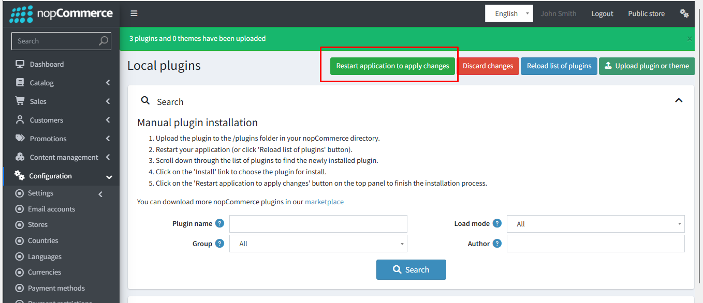
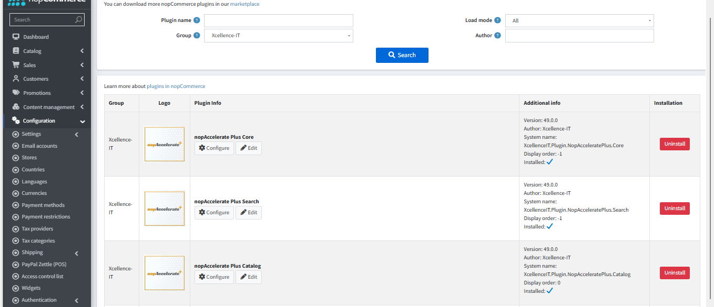

## Installation Guide

Download the **nopAccelerate Plus Pro Plugin** from our store:

[https://shop.nopaccelerate.com/nopaccelerate-plus](https://shop.nopaccelerate.com/nopaccelerate-plus)

- **Step 1:** Go to **Admin Panel → Configuration → Plugins → Local Plugins**.  

- **Step 2:** Upload the **nopAccelerate Plus Pro** zip file using the **"Upload plugin or theme"** button.  

- **Step 3:** Restart the application  

- **Step 4:** Locate **nopAccelerate Plus Pro** under the **Xcellence-IT** group.  

- **Step 5:** Click **Install** to complete the setup.  

**Note:** First install the Core plugin, then the Search plugin, and finally the Catalog plugin  

- **Step 6:** Restart the application after install plugins.

[← Previous](SupportDocOverview.md) | [Next →](Licensing&Activation.md)
