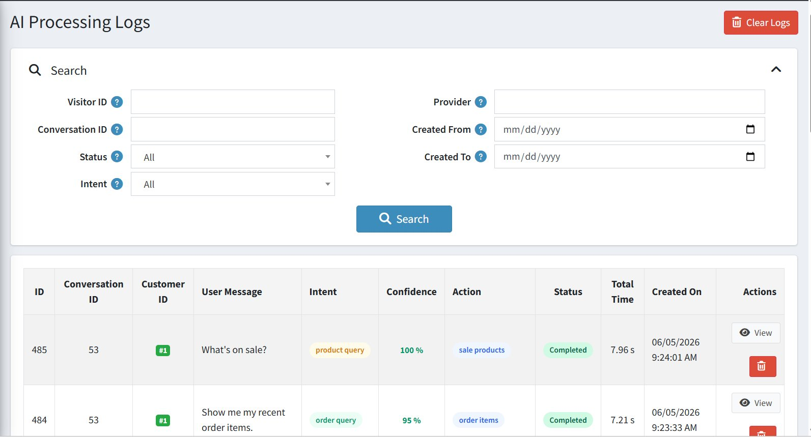

# AI Processing Logs

The **AI Processing Logs** page shows a detailed record of every question the chatbot has processed. This is useful for checking if the bot is working correctly and understanding how it is responding to customers.

## Log Columns

| **Column**           | **Description**                                                                                       |
|----------------------|-------------------------------------------------------------------------------------------------------|
| **ID**               | A unique number for each log entry.                                                                   |
| **Conversation ID**  | Links the log entry to a specific customer conversation.                                              |
| **Customer ID**      | The ID of the customer or visitor who asked the question.                                             |
| **User Message**     | The exact message the customer sent to the chatbot.                                                   |
| **Intent**           | What the AI understood the customer to be asking (e.g. greeting, order query, kb query).             |
| **Confidence**       | How certain the AI was about its answer, shown as a percentage. Higher is better.                    |
| **Action**           | The type of action the AI took (e.g. general reply, order history lookup).                           |
| **Status**           | Whether the request was completed successfully.                                                       |
| **Total Time**       | How many seconds it took to generate a response.                                                      |
| **Created On**       | The date and time the message was processed.                                                          |

## Search and Filter Options

{ .img-border }

| **Filter**                      | **Description**                                                              |
|---------------------------------|------------------------------------------------------------------------------|
| **Visitor ID / Conversation ID** | Search logs for a specific visitor or conversation.                         |
| **Provider**                    | Filter by the AI model provider used.                                        |
| **Status**                      | Filter by whether requests completed successfully or had errors.             |
| **Intent**                      | Filter by the type of question asked (e.g. show only order queries).        |
| **Created From / Created To**   | Filter logs by a specific date range.                                        |
| **Clear Logs**                  | Permanently deletes all log entries. **Use with caution.**                  |

[← Previous](knowledge-base.md) | [Next →](help.md)
