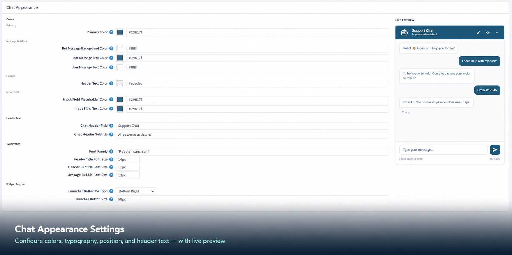

# Chat Appearance

This section lets you customize the visual look of the chatbot widget so it matches your store's branding. A **live preview** on the right side of the configuration page updates as you make changes, so you can see exactly how it will look before saving.

{ .img-border }

## Color Settings

Colors are entered as hex codes (e.g. `#3c8dbc`). You can pick a color using the color picker icon next to each field.

| **Setting**                        | **Default Value** | **Description**                                               |
|------------------------------------|-------------------|---------------------------------------------------------------|
| **Primary Color**                  | `#3c8dbc`         | The main brand color used for buttons, highlights, and key elements. |
| **Bot Message Background Color**   | `#f0f4f8`         | The background color of the chatbot's reply bubbles.          |
| **Bot Message Text Color**         | `#3c8dbc`         | The text color inside the bot's message bubbles.              |
| **User Message Text Color**        | `#ffffff`         | The text color inside the customer's message bubbles.         |
| **Header Text Color**              | `#ffffff`         | The text color displayed in the chat header bar.              |
| **Input Field Placeholder Color**  | `#3c8dbc`         | The color of the placeholder hint text inside the message input box. |
| **Input Field Text Color**         | `#3c8dbc`         | The color of the text the customer types in the input field.  |

## Text and Label Settings

| **Setting**               | **Default Value**        | **Description**                                          |
|---------------------------|--------------------------|----------------------------------------------------------|
| **Chat Header Title**     | `Support Chat`           | The main title shown in the top bar of the chat window.  |
| **Chat Header Subtitle**  | `AI-powered assistant`   | A smaller description shown below the title.             |
| **Font Family**           | `'Roboto', sans-serif`   | The font used for all text in the chat widget.           |

## Font Size Settings

| **Setting**                    | **Default Value** | **Description**                                     |
|--------------------------------|-------------------|-----------------------------------------------------|
| **Header Title Font Size**     | `14px`            | Size of the main title text in the chat header.     |
| **Header Subtitle Font Size**  | `11px`            | Size of the subtitle text in the chat header.       |
| **Message Bubble Font Size**   | `13px`            | Size of the text inside all chat message bubbles.   |

## Layout Settings

| **Setting**                    | **Default Value** | **Description**                                                        |
|--------------------------------|-------------------|------------------------------------------------------------------------|
| **Launcher Button Position**   | `Bottom Right`    | The floating chat button appears in the bottom-right corner of your store pages. |
| **Launcher Button Size**       | `58px`            | The size (diameter) of the floating chat launch button.               |

[← Previous](knowledge-base-settings.md) | [Next →](saving-configuration.md)
