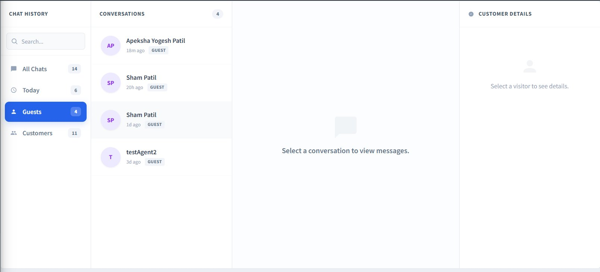

# Chat History

The **Chat History** section shows all conversations that customers have had with the chatbot. You can use it to review what was asked, check how the bot responded, and identify any gaps in support.

## Overview Panel

| **Column**           | **Description**                                                                             |
|----------------------|---------------------------------------------------------------------------------------------|
| **All Chats**        | Shows the total number of conversations recorded.                                           |
| **Today**            | Conversations that happened today.                                                          |
| **Guests**           | Conversations from visitors who are not logged in to your store.                            |
| **Customers**        | Conversations from registered store customers.                                              |

## Conversation List

Each entry in the list shows:

- **Customer name or ID**
- **How long ago** they chatted
- Whether they are a **Guest** or a **Customer**

Click on any conversation to view the full message thread between the customer and the chatbot.

{ .img-border }

[← Previous](scenarios-of-use.md) | [Next →](knowledge-base.md)
