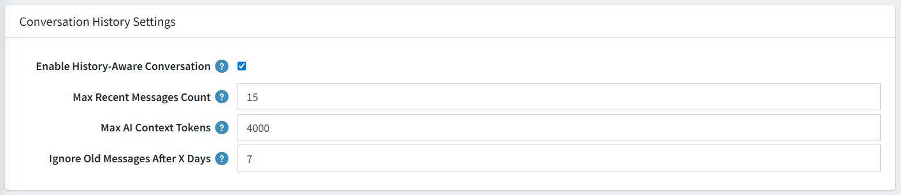

# Conversation History Settings

These settings control how the chatbot remembers and uses past messages within a customer's conversation. Proper configuration here ensures the AI gives relevant, context-aware answers rather than forgetting what was said earlier in the chat.

| **Setting**                         | **Description**                                                                                                                                    |
|-------------------------------------|----------------------------------------------------------------------------------------------------------------------------------------------------|
| **Enable History-Aware Conversation** | Checked (ON) — Enables the chatbot to understand previous messages and follow-up questions from the customer.                                    |
| **Max Recent Messages Count**       | `15` — Controls how many of the most recent chat messages the AI reads before replying. For example, if set to 15, the bot looks at the last 15 messages to understand the context before giving an answer. |
| **Max AI Context Tokens**           | `4000` — The maximum amount of conversation text (measured in tokens) sent to the AI at once. Keeps responses fast and cost-efficient.             |
| **Ignore Old Messages After X Days** | `7` — Messages older than 7 days are automatically excluded from the conversation context.                                                        |

{ .img-border }

> **Tip:** Lowering **Max Recent Messages Count** and **Max AI Context Tokens** can reduce API costs, while increasing them improves context awareness for longer conversations.

[← Previous](openrouter-configuration.md) | [Next →](knowledge-base-settings.md)
