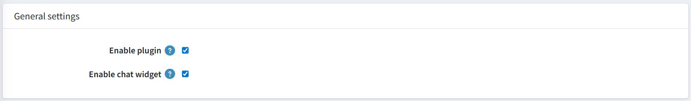

# General Settings

These two settings control whether the plugin and its chat widget are active on your store. Both should remain turned on for the chatbot to work.

| **Setting**            | **Description**                                                    |
|------------------------|--------------------------------------------------------------------|
| **Enable Plugin**      | Checked (ON) — Activates the plugin on your store.                |
| **Enable Chat Widget** | Checked (ON) — Makes the floating chat button visible to customers. |

{ .img-border }

> **Note:** If **Enable Chat Widget** is turned off, the chatbot will not appear on the storefront even if the plugin itself is enabled.

[← Previous](licence.md) | [Next →](openrouter-configuration.md)
