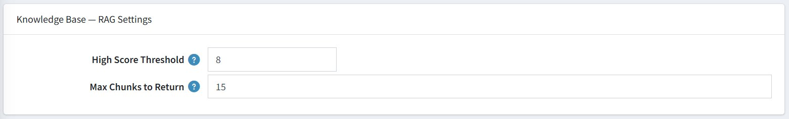

# Knowledge Base Settings (RAG)

RAG stands for **Retrieval-Augmented Generation**. This section controls how the chatbot searches your store's knowledge base to find relevant information before answering a customer's question. The better this is configured, the more accurate and specific the answers will be.

| **Setting**               | **Description**                                                                                                         |
|---------------------------|-------------------------------------------------------------------------------------------------------------------------|
| **High Score Threshold**  | `8` — Only knowledge base results that score 8 or higher (out of 10) are considered relevant and included in the AI response. |
| **Max Chunks to Return**  | `15` — The chatbot retrieves up to 15 pieces of information from your knowledge base to form an answer.                 |

{ .img-border }

> **Tip:** Increasing the **High Score Threshold** makes the bot more selective (higher accuracy, fewer but better matches). Lowering it returns more results but may include less relevant content.

[← Previous](conversation-history.md) | [Next →](chat-appearance.md)
