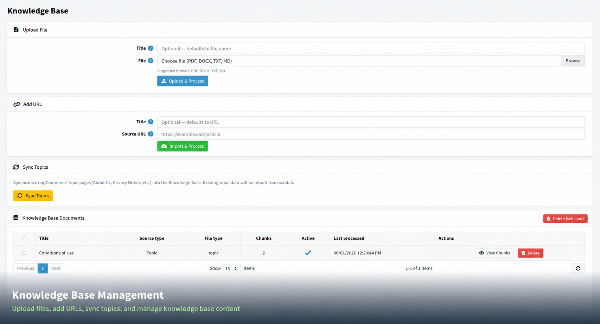

# Knowledge Base

The **Knowledge Base** is the information source the chatbot uses to answer customer questions accurately. You can add your own documents, web pages, or store topic pages so the bot gives answers specific to your business.

{ .img-border }

## Adding Content to the Knowledge Base

| **Option**        | **How It Works**                                                                                                                        |
|-------------------|-----------------------------------------------------------------------------------------------------------------------------------------|
| **Upload File**   | Upload a document in **PDF, DOCX, TXT, or MD** format. Give it an optional title, then click **"Upload & Process"**. The plugin will read the file and make its content available to the chatbot. |
| **Add URL**       | Enter a web page address (e.g. your FAQ or About Us page). Give it an optional title, then click **"Import & Process"**. The plugin will fetch and store the page content. |
| **Sync Topics**   | Automatically imports your **nopCommerce topic pages** (such as About Us, Privacy Notice, etc.) into the Knowledge Base. Any existing topic data will be refreshed from scratch. |

> **Tip:** Keep your Knowledge Base up to date. If you update your FAQ page or store policies, re-import the URL or re-sync topics so the chatbot reflects the latest information.

[← Previous](chat-history.md) | [Next →](ai-processing-logs.md)
