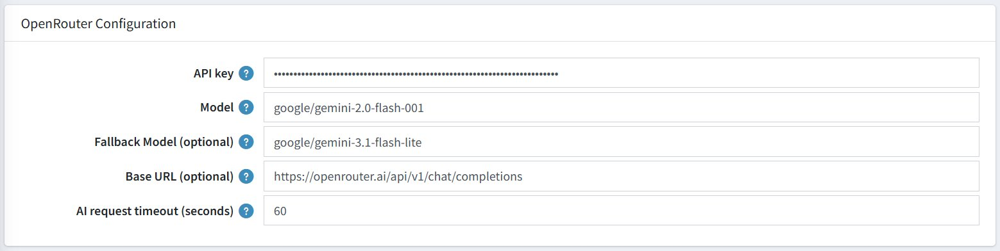

# OpenRouter Configuration

OpenRouter is the AI service that powers your chatbot's responses. You need an OpenRouter account and API key to use this plugin. These settings tell the plugin how to connect to the AI service.

| **Setting**                    | **Description**                                                                                          |
|-------------------------------|----------------------------------------------------------------------------------------------------------|
| **API Key**                   | Your secret key from OpenRouter. Treat this like a password — never share it publicly.                  |
| **Model**                     | `google/gemini-2.0-flash-001` — The primary AI model used to generate responses.                        |
| **Fallback Model (optional)** | `google/gemini-3.1-flash-lite` — A backup model used if the primary model is unavailable.               |
| **Base URL (optional)**       | `https://openrouter.ai/api/v1/chat/completions` — The service address for the AI. Leave unchanged unless instructed otherwise. |
| **AI Request Timeout (seconds)** | `60` — The plugin will wait up to 60 seconds for an AI response before giving up.                    |

{ .img-border }

## How to Get Your API Key

1. Go to [https://openrouter.ai](https://openrouter.ai) and create an account.
2. Navigate to **API Keys** in your account settings.
3. Generate a new key and copy it.
4. Paste it into the **API Key** field in the plugin configuration.

[← Previous](general-settings.md) | [Next →](conversation-history.md)
