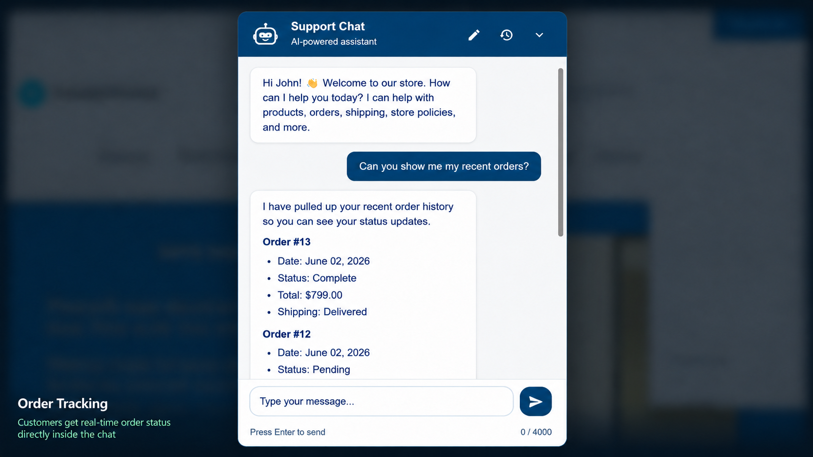
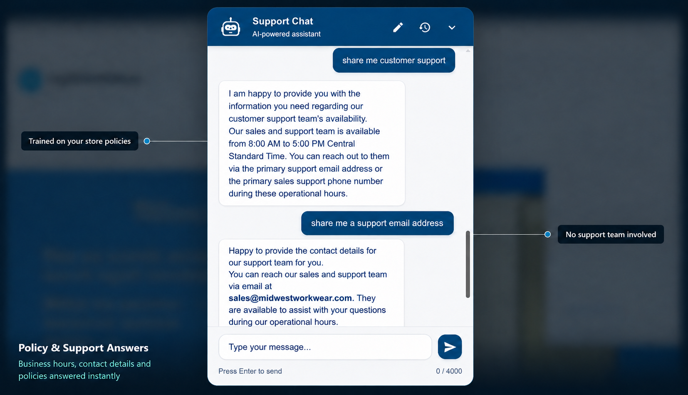
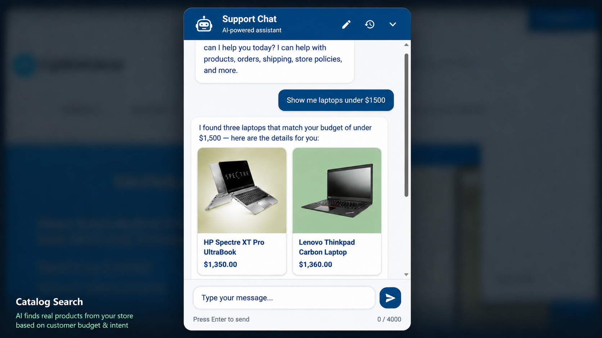

# Scenarios of Use

The following examples show how the **nopCommerce AI Chatbot** handles real customer queries on your storefront.

---

## Order Tracking

A customer asks about the status of their order. The chatbot understands the intent, looks up the relevant order information, and responds with an accurate, context-aware reply — without any manual intervention.

{ .img-border }

---

## Policy & Support Queries

A customer asks about store policies such as returns, shipping, or privacy. The chatbot retrieves the relevant content from your Knowledge Base and provides a clear, helpful answer directly in the chat.

{ .img-border }

---

## Catalog Search

A customer asks about a specific product or category. The chatbot searches your store's content and responds with relevant product information to guide the customer toward a purchase.

{ .img-border }

---

> If the chatbot is not responding as expected, check your [Knowledge Base](knowledge-base.md) content and [AI Processing Logs](ai-processing-logs.md) to diagnose the issue.

[← Previous](saving-configuration.md) | [Next →](chat-history.md)
