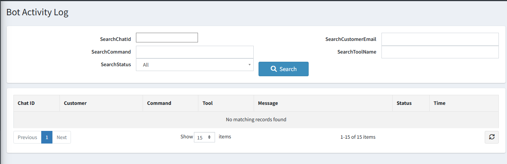

# Bot Activity Log

The **Bot Activity Log** provides a complete audit trail of every command and action performed through the Telegram bot. Use it to review what was done, by whom, and whether it succeeded.

{ .img-border }

## Search and Filter Options

| **Filter**                  | **Description**                                                    |
|-----------------------------|--------------------------------------------------------------------|
| **Search Chat ID**          | Filter logs for a specific Telegram Chat ID.                       |
| **Search Customer Email**   | Filter by the email address of the linked customer.                |
| **Search Command**          | Filter by the command or message the user sent.                    |
| **Search Tool Name**        | Filter by the specific AI tool that was invoked.                   |
| **Search Status**           | Filter by outcome — All, Success, Error, or Blocked.               |

## Log List Columns

| **Column**    | **Description**                                                          |
|---------------|--------------------------------------------------------------------------|
| **Chat ID**   | The Telegram Chat ID that sent the command.                              |
| **Customer**  | The linked nopCommerce customer account.                                 |
| **Command**   | The message or command the user typed.                                   |
| **Tool**      | The specific registered tool that was called to execute the action.      |
| **Message**   | A summary of what happened — success confirmation or error detail.       |
| **Status**    | Color-coded outcome: **Success** (green), **Error** (red), **Blocked** (orange). |
| **Time**      | When the command was processed.                                          |

> **Note:** Old logs are automatically removed based on the retention period configured in settings. You can also manually clear logs from the settings page.

[← Previous](scheduled-reports.md) | [Next →](help.md)
