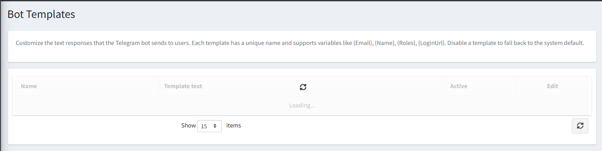

# Bot Templates

The **Bot Templates** page lets you customize the text responses that the Telegram bot sends to users — such as welcome messages, error messages, help text, and confirmation prompts.

{ .img-border }

## How Templates Work

Each template has a unique **Name** and a **Template Text** field. Templates support dynamic variables such as `{Email}`, `{Name}`, `{Roles}`, and `{LoginUrl}` which are automatically replaced with real values when the message is sent.

- If a template is set to **Active**, the bot uses your custom text.
- If a template is **disabled**, the bot falls back to the built-in system default for that message.

## Template List Columns

| **Column**        | **Description**                                               |
|-------------------|---------------------------------------------------------------|
| **Name**          | The internal identifier for this template.                    |
| **Template Text** | The message text the bot will send, with variable placeholders. |
| **Active**        | Whether this custom template is currently in use.             |
| **Edit**          | Opens the template for editing.                               |

> **Tip:** You can export and import all templates as a JSON file for backup or to copy your customizations to another store.

[← Previous](chat-access-rules.md) | [Next →](scheduled-reports.md)
