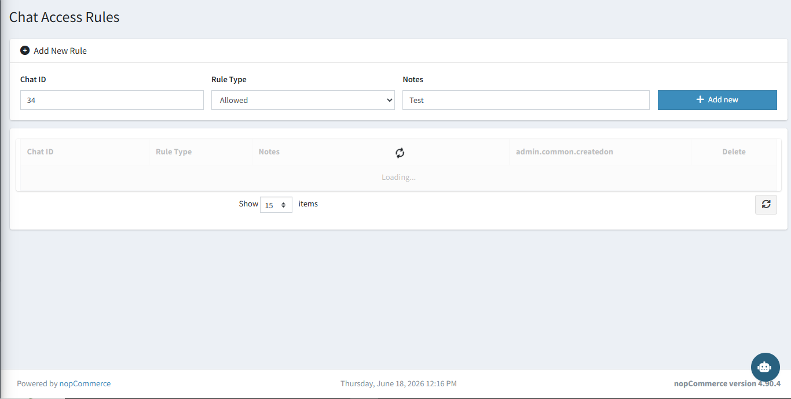

# Chat Access Rules

The **Chat Access Rules** page controls exactly which Telegram users are permitted or blocked from using the bot. Rules take effect immediately without requiring a restart.

{ .img-border }

## Adding a Rule

Fill in the fields at the top of the page and click **+ Add New**:

| **Field**      | **Description**                                                                      |
|----------------|--------------------------------------------------------------------------------------|
| **Chat ID**    | The Telegram Chat ID of the user to allow or block.                                  |
| **Rule Type**  | `Allowed` — grants access. `Blocked` — denies access regardless of other settings.  |
| **Notes**      | Optional internal note to describe why this rule was added.                          |

## Rule List

All existing rules are shown in the grid below the add form. Each row displays the Chat ID, Rule Type, Notes, creation date, and a Delete button to remove the rule.

> **How it works:** If an **Allowlist** rule exists, only Chat IDs on that list can use the bot. If a **Blocklist** rule exists for a Chat ID, that user is always denied — even if they are also on the allowlist.

[← Previous](telegram-sessions.md) | [Next →](bot-templates.md)
