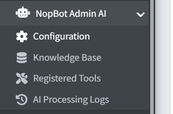

# nopCommerce Admin AI Chatbot

The **nopCommerce Admin AI Chatbot** plugin brings an AI-powered assistant directly into your nopCommerce admin panel. Instead of navigating menus manually, you can type plain English commands and let the AI search, update, and manage your store for you.

Once configured, the plugin provides:

- An **AI chat widget** embedded in the admin sidebar for instant store management
- **60+ pre-built store management tools** covering products, orders, customers, promotions, and more
- A **Telegram bot integration** to manage your store from your phone
- A **Store Health Auditor** running 40+ automatic checks across your store
- **Scheduled reports** delivered automatically to Telegram in Excel, CSV, or PDF format

| **Plugin Name**     | nopCommerce Admin AI Chatbot                    |
|---------------------|-------------------------------------------------|
| **Version**         | 2.0.0.3                                         |
| **Author**          | Xcellence-IT                                    |
| **Compatible With** | nopCommerce 4.90+ / .NET 9.0+                  |
| **System Name**     | Widgets.NopBotAdminAI                           |

{ .img-border }

[Next →](features.md)
