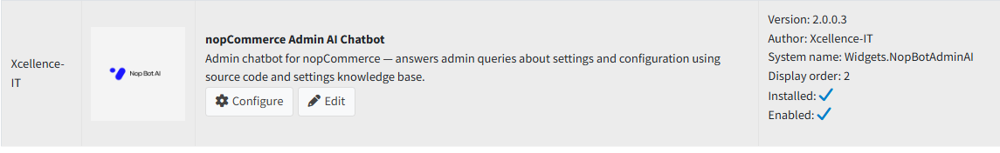

# Licensing & Activation

- After installation, open the plugin **configuration page**.
- You will be prompted to enter your **License Key**.
- Enter the license key received on your **registered email** after purchase.
- Click **Save** to activate the plugin.

Below is a summary of the installed plugin details. These are read-only values shown on the plugin list page.

| **Plugin Name**    | nopCommerce Admin AI Chatbot                   |
|--------------------|------------------------------------------------|
| **Description**    | Admin chatbot for nopCommerce — answers admin queries about settings and configuration using source code and settings knowledge base |
| **Version**        | 2.0.0.3                                        |
| **Author**         | Xcellence-IT                                   |
| **System Name**    | Widgets.NopBotAdminAI                          |
| **Display Order**  | 2                                              |
| **Installed**      | Yes                                            |
| **Enabled**        | Yes                                            |

{ .img-border }

[← Previous](installation.md) | [Next →](settings.md)
