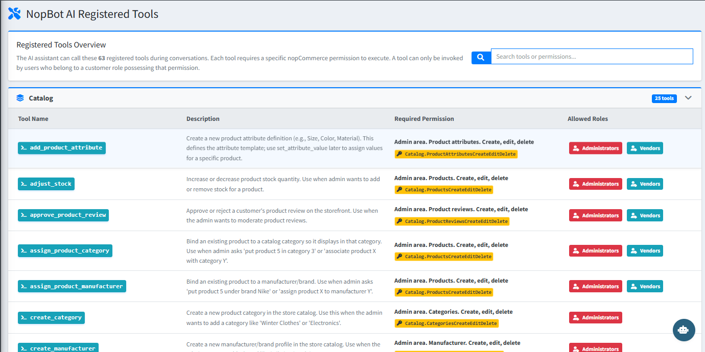

# Registered Tools

The **NopBot AI Registered Tools** page shows every store management command the AI can execute on your behalf. Each tool maps to a specific nopCommerce permission and is only available to users whose role holds that permission.

{ .img-border }

There are **63 registered tools** across the following categories:

| **Category**         | **Tools** | **Examples**                                                    |
|----------------------|-----------|-----------------------------------------------------------------|
| Catalog              | 25        | Add product attributes, adjust stock, approve reviews, assign categories, create manufacturers |
| Orders               | 13        | Add order notes, create shipments, approve returns, update order status, process refunds, void orders |
| Customers            | 4         | Update customer details, adjust reward points                   |
| Promotions           | 4         | Create discounts, gift cards, email campaigns                   |
| ContentManagement    | 4         | Create and update topic pages (About Us, Shipping Policy, etc.) |
| Configuration        | 4         | Update store settings, clear cache, configure tax rates, toggle payment methods |
| System               | 2         | Send emails, system-level actions                               |
| NopBotAdminAi        | 1         | Plugin-specific internal tool                                   |
| Unrestricted         | 6         | Navigation, help, and general information commands              |

{ .img-border }

> **Tip:** Use the **Search tools or permissions** box at the top of the page to quickly find a specific tool by name or permission string.

## How Tools Work

- Type a plain-English command in the AI chat (e.g. *"Adjust stock for product ID 5 by +10"*).
- The AI identifies the correct tool, confirms the action with you, and executes it only after your approval.
- Read-only actions (search, get, list) execute immediately. Write operations always require confirmation first.

[← Previous](settings.md) | [Next →](knowledge-base.md)
