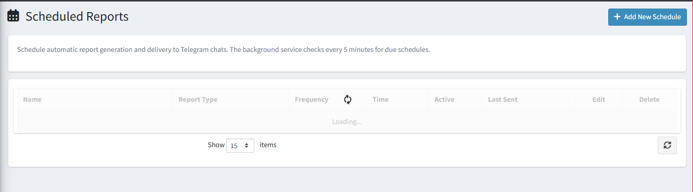

# Scheduled Reports

The **Scheduled Reports** page lets you set up automatic report delivery to Telegram. Reports are generated in the background and sent on your chosen schedule without any manual action.

{ .img-border }

## Available Report Types

| **Report**                | **Description**                                              |
|---------------------------|--------------------------------------------------------------|
| Sales Summary             | Overall revenue and order totals for the period.             |
| Bestsellers               | Top-selling products ranked by quantity or revenue.          |
| Customer Report           | New and active customer counts.                              |
| Sales by Country          | Revenue breakdown by customer country.                       |
| Never Sold Products       | Products with zero sales in the selected period.             |
| Low Stock                 | Products below the configured stock threshold.               |
| Revenue                   | Detailed revenue figures with trend comparison.              |
| Customer Acquisition      | New customer registrations over time.                        |

## Export Formats

Reports can be downloaded or delivered in **Excel (XLSX)**, **CSV**, or **PDF** format.

## Creating a Schedule

Click **+ Add New Schedule** in the top-right corner and fill in:

| **Field**         | **Description**                                                         |
|-------------------|-------------------------------------------------------------------------|
| **Name**          | A label for this schedule (e.g. "Weekly Sales to Manager").             |
| **Report Type**   | The report to generate (see list above).                                |
| **Frequency**     | Daily, Weekly, or Monthly.                                              |
| **Time**          | The time of day to generate and send the report.                        |
| **Active**        | Toggle to enable or pause this schedule.                                |

## Schedule List Columns

| **Column**      | **Description**                                              |
|-----------------|--------------------------------------------------------------|
| **Name**        | The label for this schedule.                                 |
| **Report Type** | Which report is being sent.                                  |
| **Frequency**   | How often the report is delivered.                           |
| **Time**        | Scheduled send time.                                         |
| **Active**      | Whether the schedule is currently running.                   |
| **Last Sent**   | When the report was last successfully delivered.             |
| **Edit**        | Modify this schedule.                                        |
| **Delete**      | Remove this schedule permanently.                            |

> **Tip:** Use the **Send Now** option on a schedule to deliver an immediate report without waiting for the scheduled time.

[← Previous](bot-templates.md) | [Next →](bot-activity-log.md)
