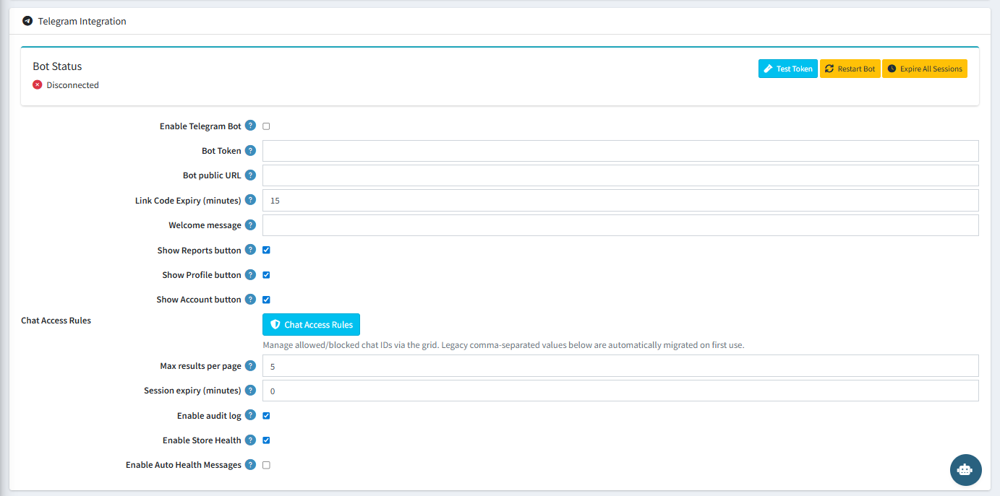

# Telegram Integration

The **Telegram Integration** section lets you connect a Telegram bot to your store so you can manage it from your phone. All 60+ AI commands work through Telegram exactly as they do in the admin panel.

{ .img-border }

## Bot Status

The **Bot Status** panel at the top of the section shows whether the bot is currently connected or disconnected. Three utility buttons are available:

| **Button**             | **Action**                                                         |
|------------------------|--------------------------------------------------------------------|
| **Test Token**         | Verifies that the entered Bot Token is valid and can connect to Telegram. |
| **Restart Bot**        | Restarts the Telegram bot connection without restarting nopCommerce. |
| **Expire All Sessions** | Immediately invalidates all active Telegram user sessions.        |

## Configuration Settings

| **Setting**                    | **Description**                                                                                          |
|-------------------------------|----------------------------------------------------------------------------------------------------------|
| **Enable Telegram Bot**        | Checked (ON) — Activates the Telegram bot.                                                               |
| **Bot Token**                  | Your Telegram bot token from [@BotFather](https://t.me/BotFather). Required to connect.                 |
| **Bot Public URL**             | The public HTTPS URL of your nopCommerce store. Required for webhook delivery.                           |
| **Link Code Expiry (minutes)** | `15` — The one-time login code sent to Telegram expires after this many minutes.                         |
| **Welcome Message**            | Custom text sent to a user when they start a conversation with the bot.                                  |
| **Show Reports Button**        | Checked (ON) — Shows a Reports shortcut button in the Telegram menu.                                     |
| **Show Profile Button**        | Checked (ON) — Shows a Profile shortcut button in the Telegram menu.                                     |
| **Show Account Button**        | Checked (ON) — Shows an Account shortcut button in the Telegram menu.                                    |
| **Chat Access Rules**          | Opens the [Chat Access Rules](chat-access-rules.md) management grid for allowlist/blocklist control.     |
| **Max Results Per Page**       | `5` — The number of results shown per page in Telegram list responses.                                   |
| **Session Expiry (minutes)**   | `0` — Set to 0 for sessions that never expire, or enter a value to auto-logout idle users.              |
| **Enable Audit Log**           | Checked (ON) — Logs all bot activity to the [Bot Activity Log](bot-activity-log.md).                    |
| **Enable Store Health**        | Checked (ON) — Enables store health monitoring and reporting via Telegram.                               |
| **Enable Auto Health Messages** | When enabled, automatically sends health alert messages to Telegram when issues are detected.           |

## How to Link Your Telegram Account

1. Enable the Telegram Bot and enter your **Bot Token** and **Bot Public URL**, then save.
2. Open your Telegram app and search for your bot by its username.
3. Send `/login` to the bot.
4. The bot will reply with a one-time link code.
5. Enter that code in the **Telegram Login** page in the admin panel to link your account.

## Telegram Bot Commands

| **Command** | **Description**                           |
|-------------|-------------------------------------------|
| `/start`    | Start a conversation with the bot         |
| `/login`    | Generate a one-time link code to authenticate |
| `/logout`   | Log out of the current session            |
| `/status`   | Check store and bot status                |
| `/health`   | Get an instant store health report        |
| `/reports`  | Access available reports                  |
| `/help`     | Show available commands                   |

[← Previous](knowledge-base.md) | [Next →](telegram-sessions.md)
