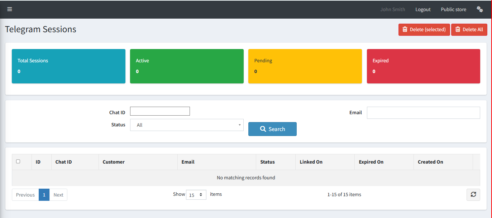

# Telegram Sessions

The **Telegram Sessions** page shows all accounts that have linked their Telegram to your store. You can monitor active sessions and remove them when needed.

{ .img-border }

## Session Summary Cards

| **Card**            | **Description**                                           |
|---------------------|-----------------------------------------------------------|
| **Total Sessions**  | The total number of Telegram accounts ever linked.        |
| **Active**          | Sessions currently logged in and able to send commands.   |
| **Pending**         | Sessions where the link code was generated but not yet confirmed. |
| **Expired**         | Sessions that have timed out or been manually expired.    |

## Search and Filter

You can search sessions by **Chat ID**, **Email**, or **Status** (All, Active, Pending, Expired) and click **Search** to filter the list.

## Session List Columns

| **Column**      | **Description**                                              |
|-----------------|--------------------------------------------------------------|
| **ID**          | Unique session record ID.                                    |
| **Chat ID**     | The Telegram Chat ID of the linked user.                     |
| **Customer**    | The nopCommerce customer account linked to this session.     |
| **Email**       | Email address of the linked customer.                        |
| **Status**      | Current session status — Active, Pending, or Expired.        |
| **Linked On**   | The date and time the account was successfully linked.       |
| **Expired On**  | The date and time the session expired (if applicable).       |
| **Created On**  | The date and time the link code was first generated.         |

> **Tip:** Use **Delete (selected)** to remove specific sessions, or **Delete All** to clear all sessions at once. This forces all users to re-authenticate.

[← Previous](telegram-integration.md) | [Next →](chat-access-rules.md)
