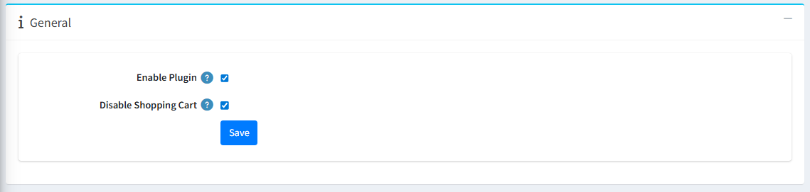

The **General** tab contains basic configuration settings for the One Page Checkout plugin.  
From here, the admin or store owner can control whether the plugin is active and how the shopping cart behaves.

### General Settings

- **Enable/Disable Plugin :** This setting allows the administrator to enable or disable the One Page Checkout plugin.  
    - **Note:** After enabling, you need to restart your application. 

- **Disable Shopping Cart :** This setting allows the administrator to enable or disable the Shopping Cart page.  
    - When enabled, customers are redirected directly to the One Page Checkout without viewing the separate shopping cart page.  
    - When disabled, the shopping cart page is displayed separately before checkout.

[← Previous](Licence.md) | [Next →](SenerioOfUse.md)