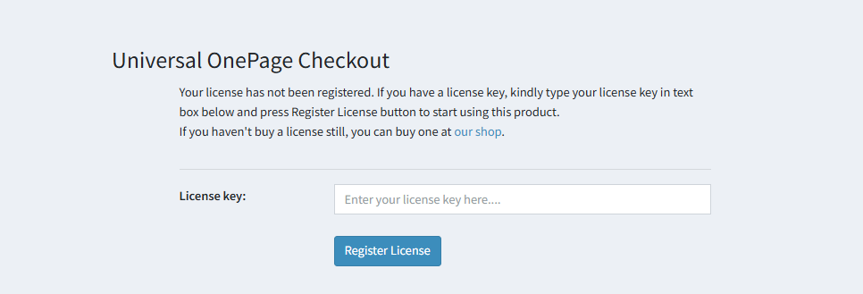

# Installation & Licensing

Download the plugin package and place it in your **Plugins** folder, then follow the standard nopCommerce plugin installation procedure.

The **Universal One Page Checkout** plugin appears under the **Promotions** group on the *Local plugins* page.

Once installed:

1. Go to your nopCommerce **Admin Panel**.
2. Navigate to:  
    **nopAccelerate > OnePage Checkout > Configuration.**    
    
    or 

    **Configuration > Plugins > Local plugins > Universal OnePage Checkout.** 

3. The plugin will prompt you to enter your license key (as shown in the figure below).
4. Enter the license key you received via email after purchasing the plugin from our website.

[← Previous](1.0.0.md) | [Next →](Configuration.md)