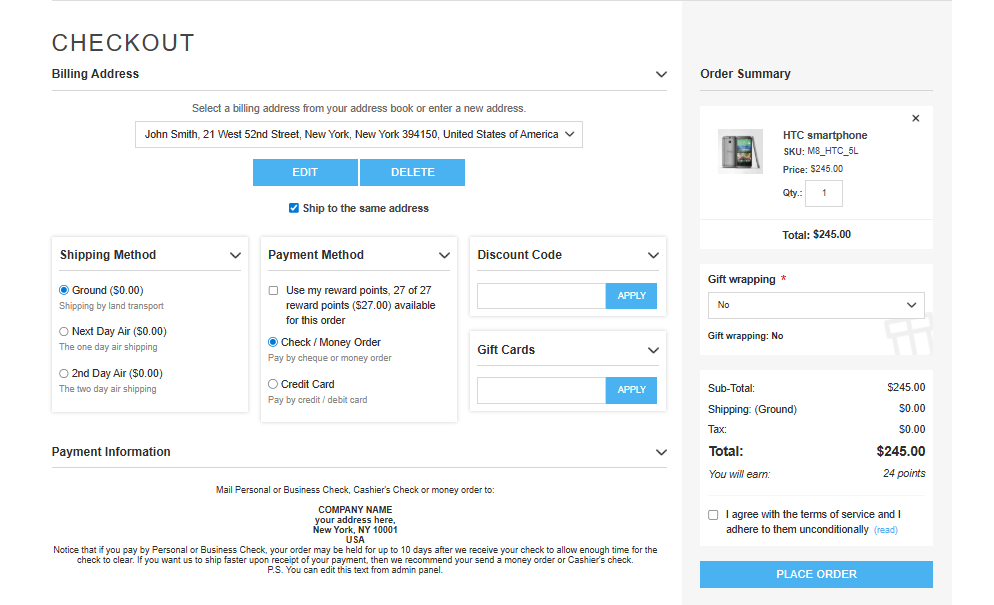

This section provides common usage Scenarios for the **Universal One page Checkout** plugin.

## Checkout Page
To display Universal One Page Checkout, configure the plugin settings. The checkout page will appear as shown below.

[← Previous](Configuration.md) | [Next →](Help.md)