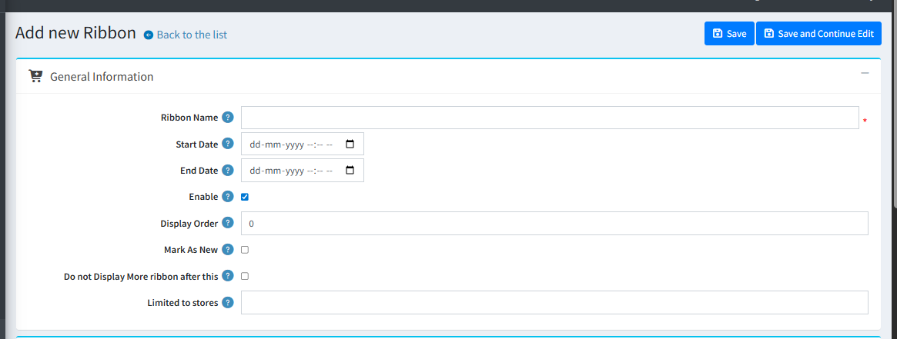

- Add ribbon tab will provides functionality to create a new ribbon with all details.  
- You can create as many ribbons as you want.

1. **Ribbon name** : This is the name of the ribbon and is a required field. It is needed, so that you can separate your ribbons from each other as you can have as many ribbons as you want.
2. **Ribbon Start Date** : Set the start date from which the Ribbon will be activated. This is very useful for example when you want to show a ribbon for a season sale and you can set when the promotion of this sale to start.
3. **Ribbon End Date** : Setting the end date to which the ribbon will be active. This is useful when you want to stop showing the ribbon after this date.
4. **Enabled** : Enable status makes Ribbon is available for displaying on home page.
5. **Display Order** : A lower number is a higher priority ! Set the priority of the product ribbon.
6. **Mark As New** : Check/ Uncheck to enable/disable then ribbon will apply on mark as new product(apply on new product of nopCommerce).
7. **Do not Display More Ribbon after this** : It is possible that you have several ribbons that could be shown for a given product, so if this is checked no other ribbon will be show after this one is shown.
8. **Limited to Store** : Option to limit this Ribbon to a certain store. If you have multiple stores, choose one or several from the list. If you don't use this option just leave this field empty.

[← Previous](ManageProductRibbon.md) | [Next →](AddproductpictureRibbonTab.md)
