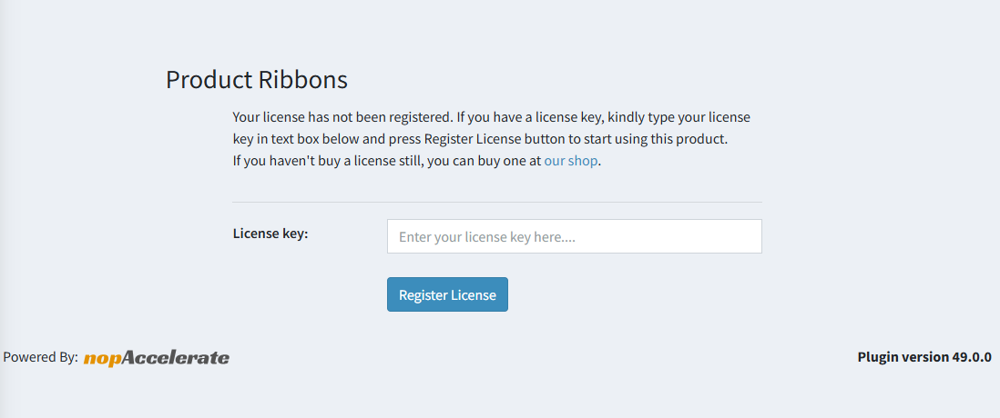

Download the plugin files and place it in your **/Plugins** folder. Then follow the standard nopCommerce plugin installation procedure to install the plug-in.

The **ProductRibbon** plug-in will appear on the **Local Plugins** page.

Once the plug-in is installed, go to your nopCommerce admin panel and navigate to:

**Configuration → Plugins → Local plugins → ProductRibbon**  
or  
**nopAccelerate → ProductRibbon → General Settings**

You will be asked to enter your license key as shown in the figure below.  
Enter the license key you received at your registered email address after purchasing this plug-in from our website.

[← Previous](1.0.0.md) | [Next →](GeneralSettings.md)
