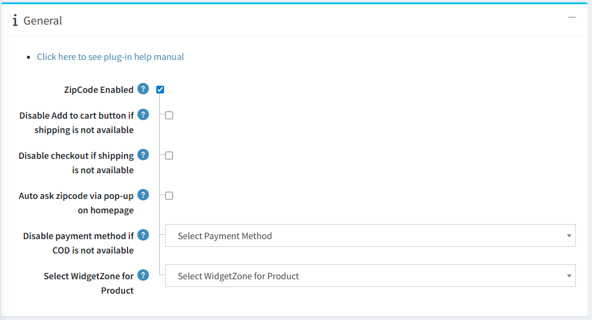

Configure the plug-in from the **General** tab as shown below.

- **ZipCode Enabled :** Enable the plug-in by checking checkbox.

- **Disable Add to cart button if shipping is not available :** 
  Enable to hide the **Add to Cart** button when shipping is not available for the entered Zip Code.  
  
- **Disable checkout if shipping is not available :**
  Enable to block checkout when shipping isn’t available for any selected produc.

- **Auto ask zipcode via pop-up on homepage :**
  Enable to automatically prompt new visitors for their Zip Code on the homepage. 

- **Disable payment method if COD is not available :** 
  Select which payment method should be disabled when COD is unavailable using this setting.

- **Select WidgetZone for Product :**
  Select widgetzone for display zipcode check on prodcut page  

[← Previous](Licence.md) | [Next →](ZipCodeListTabConfiguration.md)