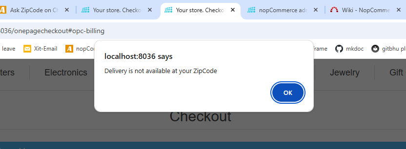

If the setting **“Disable checkout if shipping is not available”** is enabled, the customer will be prevented from proceeding to the shipping address step during checkout when their entered Zip Code is not serviceable. This restriction appears as shown in the image below.

[← Previous](ZipCodeOnProductDetailPage.md) | [Next →](ZipcodeForCODMethod.md)