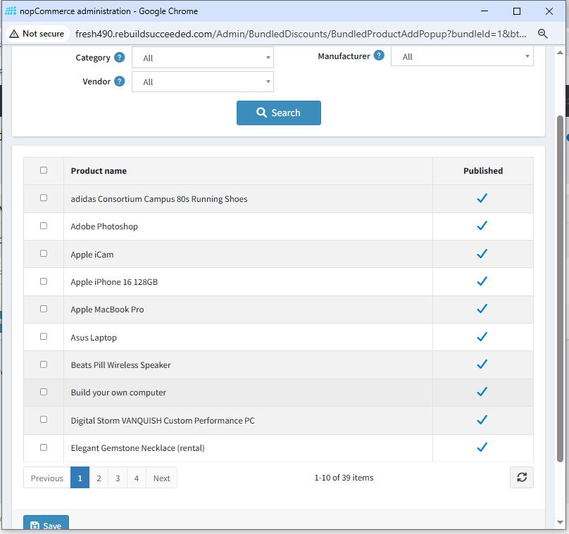

# Add bundled products

You can add one or more products to the bundle by selecting the checkboxes for the products you want to include.

{ .img-border }

You can filter products using the fields provided above the product list.

The product list shows items that are eligible to be added to a bundle. Products appear in the list when they meet the following criteria:

- The product is not already part of the **selected bundle**.
- The product is not the **main (base) product** of the bundle.
- The product is a **standard product type** (not grouped).
- The product is not configured as a **gift card**.
- The product uses a **fixed price** set by the store.
- For vendor users, the product belongs to your account.

**Note: Custom products are not supported by this plugin.**

If none of the above conditions apply, please contact our support team. Refer to [How to get help.](Help.md) for assistance.

[← Previous](BundledProducts.md) | [Next →](senerioOfUse.md)