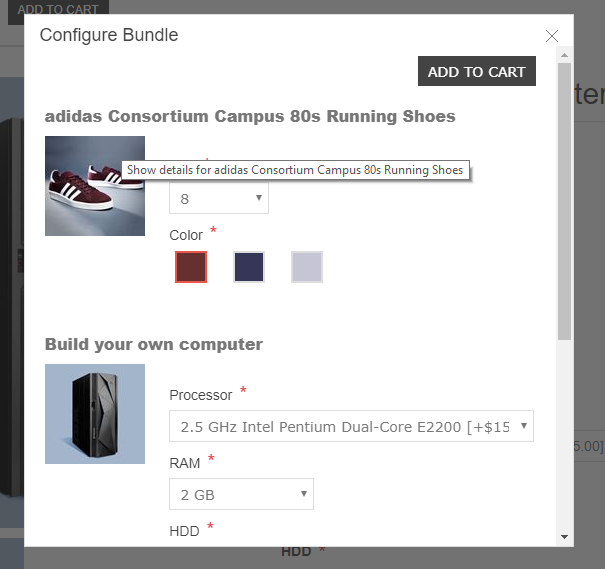

# Attribute Pop-up

As you see in below image you can set attributes as per your requirement.

Any required attribute if left unset, will show you an error while all attributes set properly will add the bundle to the cart.

[← Previous](senerioOfUse.md) | [Next →](BundleDiscountSummary.md)