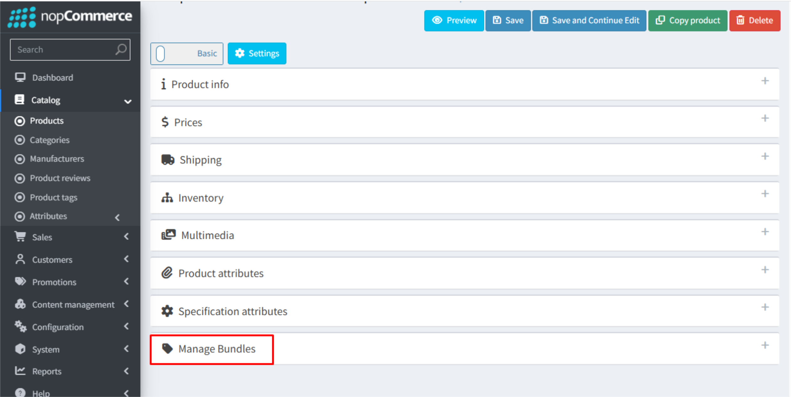

# Accessing the Manage Bundles Tab

- **Step 1:** Go to **Admin Panel**.
- **Step 2:** Navigate to **Catalog → Products**.
- **Step 3:** Select the product you want to add to the bundle.
- **Step 4:** Click **Edit** to open the **Product Edit** page.

Once the **Product Edit** page opens, you will see the **Manage Bundles** tab as shown below.

{ .img-border }

When you click this tab, a page will appear where you can create, manage, and configure product bundles.

[Manage Bundles](ManageBundles.md)

The **Manage Bundles** tab will not be displayed if the product falls under any of the following conditions, as these scenarios are **not supported** by the plugin:

- The product is a **Grouped Product**.
- The product is a **Gift Card**.
- **Customer Enters Price** is enabled for the product.

If none of the above conditions apply to your product, you can get help from our team. Please refer 
[How to get help.](Help.md)

[← Previous](Configuration.md) | [Next →](ManageBundles.md)