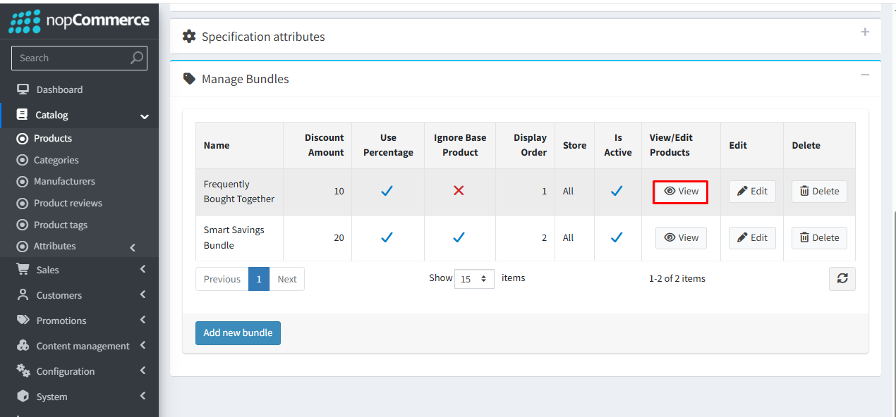
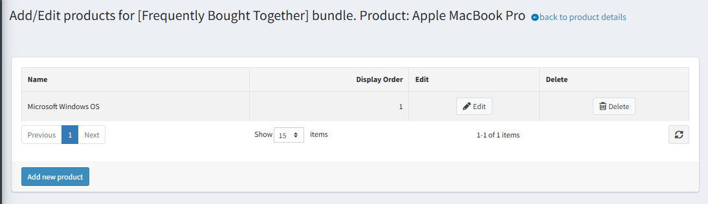

# Bundled Products

To check the list of products, click **View** for the bundle in which you want to add or manage products.

{ .img-border }

You can view the list of products added to the bundle here.  
**Display Order** controls the sequence in which products are shown within a bundle on the product details page. The base product is displayed first, followed by the offer products, in the order defined in the bundle configuration.

{ .img-border }

You can add multiple product to the bundle by clicking the [Add Product](Addbundledproducts.md) link.

[← Previous](ManageBundles.md) | [Next →](Addbundledproducts.md)