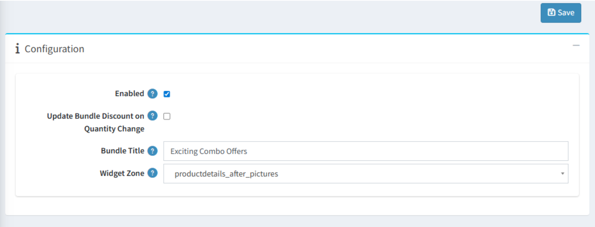

# How to Configure the Bundle Discount Plugin

- **Enable** the plugin to start using all available features.
- You can **enable or disable** the plugin from the **General** tab of the plugin configuration page.
- **Bundle Title** defines the heading displayed for bundle offers on the product details page.
- **Widget Zone** controls where the bundle section appears on the product details page.
- During uninstallation, you can choose whether to **remove all bundle-related data** from the database.

{ .img-border }

[← Previous](Licence.md) | [Next →](BundleConfiguration.md)