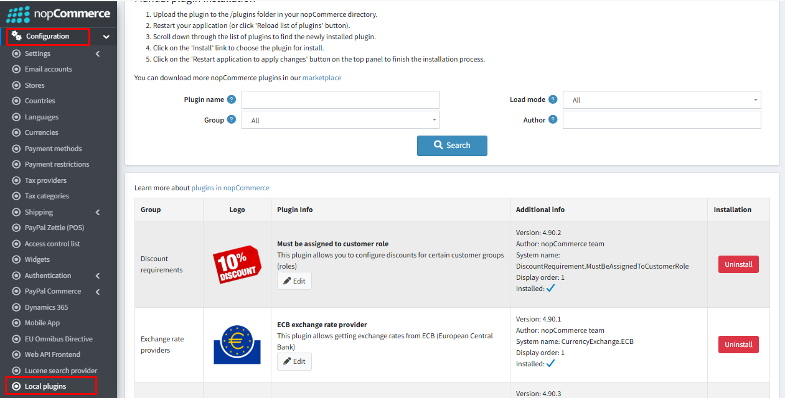
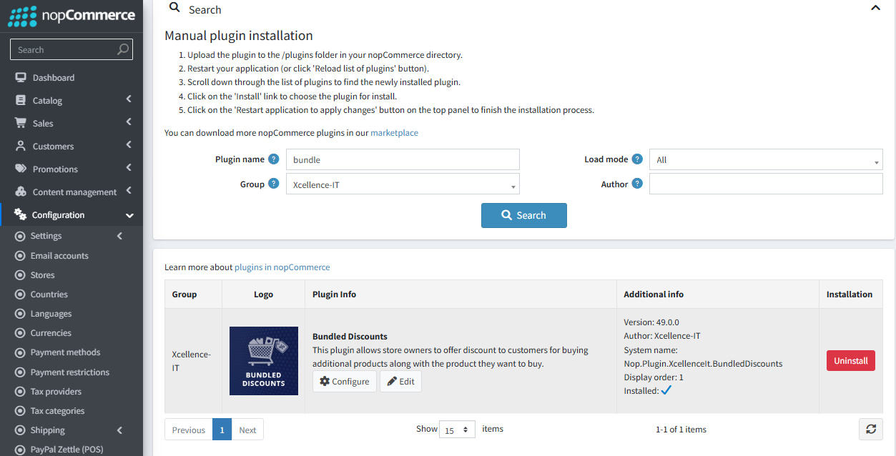
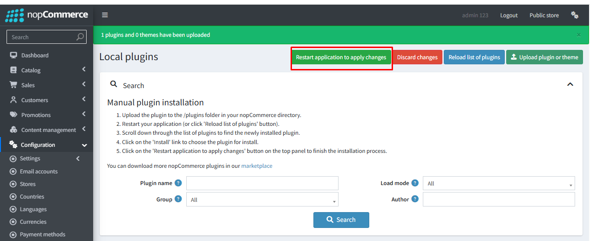

👉 Download the **Bundle Discount Plugin** from our store:  
[https://shop.nopaccelerate.com/bundled-discounts-plugin-nopcommerce](https://shop.nopaccelerate.com/bundled-discounts-plugin-nopcommerce)

- **Step 1:** Go to **Admin Panel → Configuration → Plugins → Local Plugins**.
- **Step 2:** Upload the **BundleDiscount** zip file using the **"Upload plugin or theme"** button.

- **Step 3:** Locate **Bundled Discounts Plugin** under the **Xcellence-IT** group.
- **Step 4:** Click **Install** to complete the setup.

- **Step 5:** **Restart** the application to complete the setup and start using the plugin.

[← Previous](1.0.0.md) | [Next →](Licence.md)