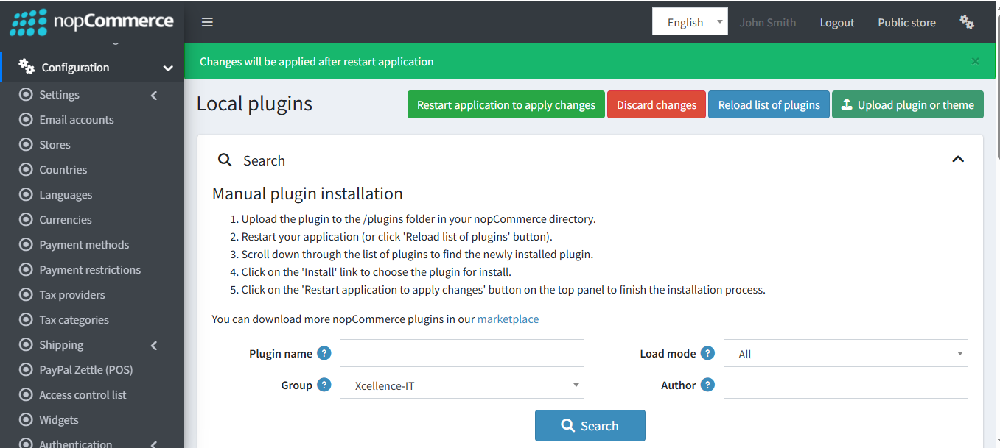

👉 Download the **Bundle Discount Plugin** from our store:  
[https://shop.nopaccelerate.com/bundled-discounts-plugin-nopcommerce](https://shop.nopaccelerate.com/bundled-discounts-plugin-nopcommerce)

**Step 1** : Go to **Administration → Configuration → Local plugins**.

{ .img-border }

**Step 2** : Upload the **Bundle Discount plugin** zip file using the **"Upload plugin or theme"** button.

**Step 3** : Restart the application.

{ .img-border }

**Step 4** : Locate **Bundle Disccount** under the **Xcellence-IT** group.

**Step 5** : Click **Install** to complete the setup.

{ .img-border }

**Step 6** : After installation, click **“Restart application to apply changes”** at the top of the page.

{ .img-border }

[← Previous](1.0.0.md) | [Next →](Licence.md)