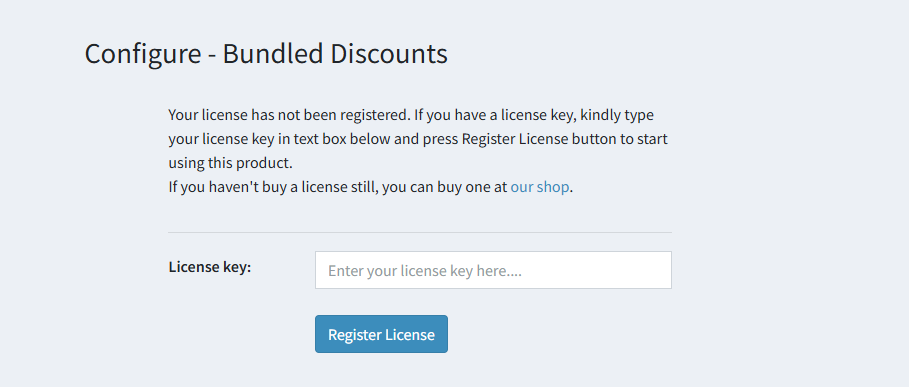

# Installation & Licensing

Download plug-in object code and put it at your plug-ins folder then follow nopCommerce standard plug-in installation procedure to install plug-in. Bundled Discounts plug-in is available under “Promotions” group on local plug-ins page.

Once plug-in is installed go to your nopCommerce admin panel, and go to:

**Configuration → Plug-ins → Local plug-ins → Bundled Discounts plug-in**

It will ask you to enter your license key as shown in figure below. Enter the license key which you received on your registered email after purchasing this plug-in from our website.

[← Previous](1.3.0.md) | [Next →](Configuration.md)