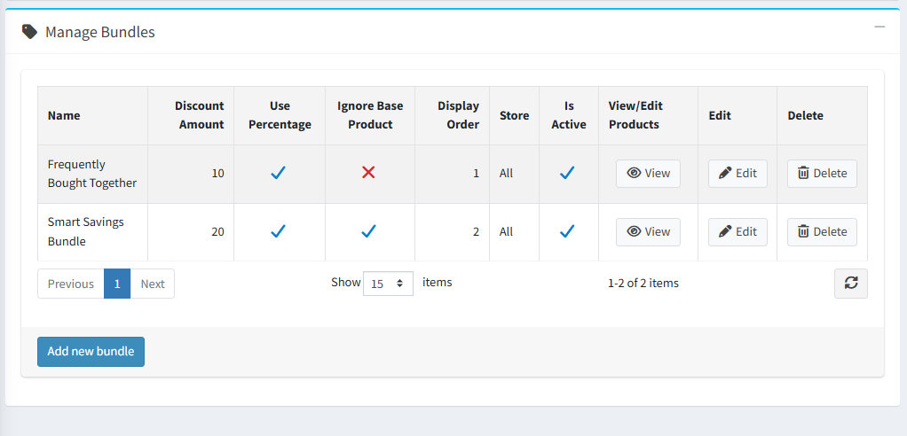

# Manage Bundles

As shown in the image below, you can add multiple bundles for a single base product.

{ .img-border }

## Bundle Configuration Fields

- **Name** – Defines the bundle name displayed to customers.
- **Discount Amount** – Specifies the discount applied to the bundle.
- **Use Percentage** – Determines whether the discount is applied as a percentage or a fixed amount.
- **Display Order** – Controls the sequence in which bundles appear on the product details page.
- **Store** – Selects the store where the bundle will be displayed.
- **Reference Products** – Allows you to add products to the bundle and shows the number of products currently included.
- **Is Active** – Use this option to activate or deactivate the bundle. Deactivated bundles are not displayed on the product details page.

To configure bundle products, click the [Bundled Products list](BundledProducts.md) link for the respective bundle.

[← Previous](BundleConfiguration.md) | [Next →](BundledProducts.md)
