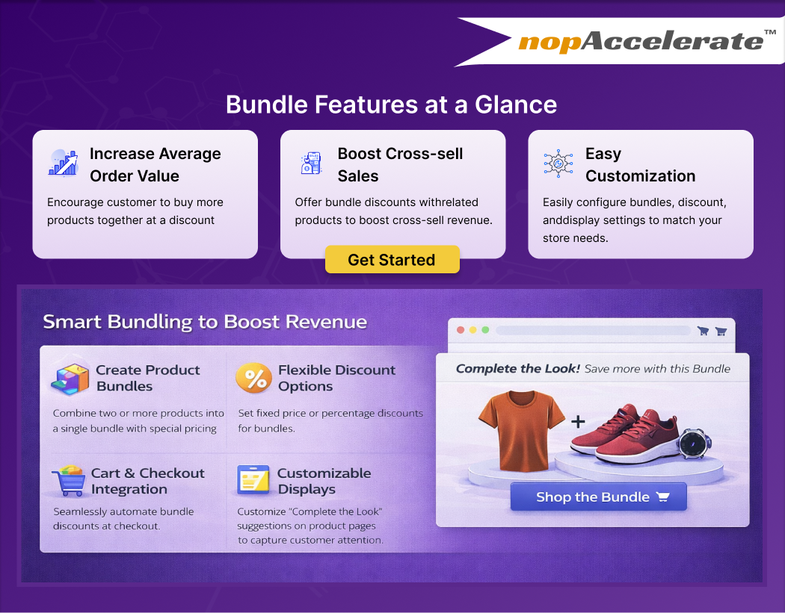

{ .img-border }

## Key Features

- **Strategic Bundling** – Create high-value product bundles with fixed or percentage discounts to encourage larger purchases.
- **Smart Visibility** – Show bundle offers directly on product pages where buying decisions happen.
- **Quick Add-to-Cart** – Let customers add the entire bundle in one click, reducing purchase friction.
- **Instant Attribute Selection** – Enable fast selection of size, colour, or other options via a pop-up without page reloads.

## General Features

- **Custom Branding** – Customise bundle titles to align with promotions and marketing campaigns.
- **One-Click Upselling** – Increase cart value by adding complete bundles instantly.
- **Smart Cart Sync** – Automatically manage discounts when bundle items change, preventing pricing issues.
- **Strategic Widget Zones** – Place bundle offers in high-conversion areas to maximise visibility.
- **Multi-Store & Multi-Currency Ready** – Sell globally with full multi-store and currency support.
- **Wide Compatibility** – Works smoothly with nopCommerce 3.70 to 4.90 (latest).
- **Scalable & Extensible** – Designed to grow with your business; custom enhancements available.

[← Previous](index.md) | [Next →](version-history.md)
